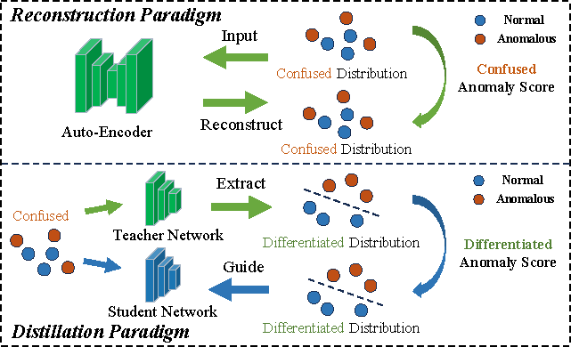
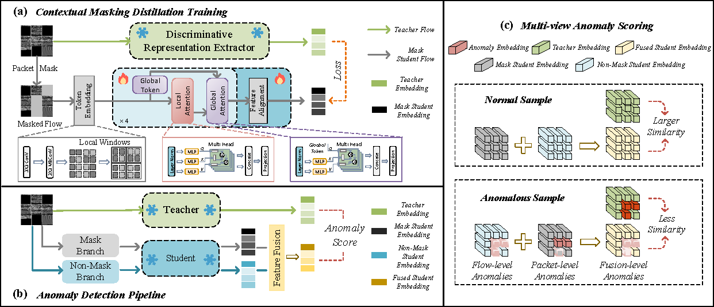

# Contextual Masking Distillation for Network Traffic Anomaly Detection

---

## 🧩 Overview

<p align="center">
  
</p>

**We revisit reconstruction-based anomaly detection for network traffic and identify a “Confused-to-Confused” issue where the reconstruction objective produces ambiguous representations. To address this, we propose ConMD, a distillation-based framework with a context-aware student network and local–global attention to capture intra- and inter-packet dependencies. A multi-view anomaly scoring mechanism further integrates packet-level and flow-level signals to improve anomaly detection in network traffic.**

📄 **Published in:** IEEE Transactions on Information Forensics and Security (TIFS), 2026  
🔗 **Paper:** [Paper Link](https://ieeexplore.ieee.org/abstract/document/11358423)


## ⚙️ Pipeline

<p align="center">
  
</p

---

## 🏃‍♀️ Requirement

We evaluate our method on enviroments and datasets as follow:

Hardware : NVIDIA GeForce RTX 3090 GPU.  
Software : Ubuntu 18.04 LTS + Python 3.9 + Pytorch 1.8.  
Datasets ： DataCon2020 + CIC-IDS2017 + USTC-TFC2016  


---

## 📌 Citation

If you find this work useful, please cite us:

```bibtex
@article{lian2026contextual,
  author       = {Xinglin Lian and Yu Zheng and Yan Liu and Fan Zhou and Chunlei Peng and Xinbo Gao},
  title        = {Contextual Masking Distillation for Network Traffic Anomaly Detection},
  journal      = {{IEEE} Transactions on Information Forensics and Security},
  volume       = {21},
  pages        = {1273--1286},
  year         = {2026},
}
```
