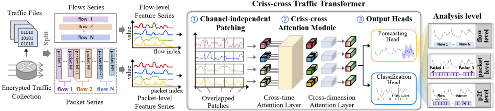

# CTT

This repository contains the official implementation of:

**Time Will Tell: Criss-cross Transformer for Encrypted Traffic Analysis**

This work is currently under review for publication in *IEEE Transactions on Services Computing*.

---

### Overview



We present a novel algorithm, **Criss-cross Traffic Transformer (CTT)**, designed to address the unique challenges of encrypted traffic analysis.

CTT offers a unified framework capable of accommodating various analytical granularities, including packet-level, flow-level, and packet-to-flow level. Beyond encrypted traffic classification, CTT also extends to encrypted traffic forecasting.

---

### Project Structure

```
CTT/
├── README.md                 # Project documentation and setup instructions
├── main.py                   # Main entry point for training and testing the model
├── grid_search_space_example.json  # Example configuration file for grid search
├── figure/                   # Figures and visualizations for the paper
├── layers/                   # Core neural network layer implementations
│   ├── CTT_backbone.py      # Main CTT architecture with cross-attention mechanisms
│   ├── CTT_layers.py        # Custom layer implementations (positional encoding, etc.)
│   ├── RevIN.py             # Reversible Instance Normalization layer
│   └── Embed.py             # Embedding layers for temporal and positional encoding
├── models/                   # Model definitions and configurations
│   └── CTT.py               # CTT model wrapper and configuration management
├── utils/                    # Utility functions and helper modules
│   ├── timefeatures.py      # Time feature extraction and encoding utilities
│   ├── tools.py             # General utility functions for data processing
│   ├── metrics.py           # Evaluation metrics and performance calculations
│   ├── masking.py           # Attention masking utilities
│   ├── grid_search.py       # Grid search module for hyperparameter tuning
│   └── upsample.py          # Class distribution printing and upsampling utilities
├── data_provider/            # Data loading and preprocessing modules
│   ├── data_loader.py       # Dataset classes for different traffic analysis levels
│   └── data_factory.py      # Data factory for creating appropriate data loaders
└── exp/                     # Experiment management and execution
    ├── exp_main.py          # Main experiment execution logic
    └── exp_basic.py         # Basic experiment configuration and setup
```
---

### SetUp

```shell
conda create -n CTT python=3.8
source activate CTT
pip install torch==1.13.1+cu116 torchvision==0.14.1+cu116 torchaudio==0.13.1 --extra-index-url https://download.pytorch.org/whl/cu116
pip install scipy==1.8.1
pip install scikit-learn
pip install matplotlib
```
---

### Data 

1. Download the datasets

You will need raw network traffic data in PCAP format.

- [ISCX-VPN2016](https://www.unb.ca/cic/datasets/vpn.html)

- [ISCX-Tor2016](https://www.unb.ca/cic/datasets/tor.html)

- [USTC-TSC2016](https://github.com/davidyslu/USTC-TFC2016) 
- [CIC-IoT2022](https://www.unb.ca/cic/datasets/iotdataset-2022.html#:~:text=This%20project%20aims%20to%20generate,%2Dbased%20and%20Z%2DWave) 
- [CSTNet-TLS1.3](https://drive.google.com/drive/folders/1BUo5TMRuXNvTqNYy0RLeHk4l4Q3BuzSk)

2. Data Preparation

Use [Tranalyzer2](https://tranalyzer.com/downloads) to preprocess PCAP files and convert network traffic into multivariate time series.

Flow-level processing:
```shell
$ t2caplist directory > pcap_list.txt
$ tranalyzer -R pcap_list.txt -w out 
```

Packet-level processing:
```shell
$ t2caplist directory > pcap_list.txt
$ tranalyzer -R pcap_list.txt -s -w out 
```

For more detailed instructions, refer to the official [Tranalyzer2 documentation](https://tranalyzer.com/download/doc/documentation.pdf).

### Train 
#### Encrypted traffic classification
- Flow-level (ISCX-VPN2016)
```shell
python -u main.py --is_training --data=ISCX-VPN2016 --mode=analysis --level=flow 
```
- Packet-level (ISCX-VPN2016)
```shell
python -u main.py --is_training --data=ISCX-VPN2016 --mode=analysis --level=packet
```
- Packet-to-flow level (ISCX-VPN2016)
```shell
python -u main.py --is_training --data=ISCX-VPN2016 --mode=analysis --level=packet2flow
```

#### Handling class imbalance with upsampling

For highly imbalanced datasets, you can enable **upsampling** on the training set to balance minority classes.  
This is controlled by two arguments:

- `--use_upsample`: enable upsampling on the training split
- `--upsample_strategy`: strategy for target samples per class
  - `balanced`: upsample all classes to the size of the largest class
  - `median`: upsample to the median class size
  - `mean`: upsample to the mean class size

Example (flow-level classification with upsampling, ISCX-VPN2016):

```shell
python -u main.py --is_training --data=ISCX-VPN2016 --mode=analysis --level=flow --use_upsample --upsample_strategy balanced
```

#### Handling class imbalance with Focal Loss

For highly imbalanced classification tasks, you can switch the loss function from standard cross-entropy to **Focal Loss** by setting the `--loss` argument to `Focal`:

- Example (flow-level classification with Focal Loss, ISCX-VPN2016):

```shell
python -u main.py --is_training --data=ISCX-VPN2016 --mode=analysis --level=flow --loss Focal
```

#### Encrypted traffic forecasting
- Flow-level (ISCX-VPN2016)
```shell
python -u main.py --is_training --data=ISCX-VPN2016 --mode=pred --level=flow 
```
- Lable-free flow-level (ISCX-VPN2016)
```shell
python -u main.py --is_training --data=ISCX-VPN2016 --mode=pred --level=flow --use_Label
```

### Grid Search for Hyperparameter Tuning

The project includes a grid search module for automatically finding optimal hyperparameters. The grid search supports tuning of key hyperparameters: `seq_len`（L）, `patch_len` (P), `stride` (S), and `factor` (c).

#### Grid Search Options

- `--grid_search`: Enable grid search mode
- `--grid_search_space`: Path to custom search space JSON file (optional, uses default if not specified)
- `--grid_search_metric`: Metric to optimize (`f1_score`, `accuracy`, or `loss`). Default: `f1_score`
- `--grid_search_results_dir`: Directory to save grid search results. Default: `./grid_search_results`


#### Basic Usage

Enable grid search with default search space:
```shell
python -u main.py --is_training --grid_search --data=ISCX-VPN2016 --mode=analysis --level=flow
```

#### Custom Search Space

You can specify a custom search space using a JSON file:
```shell
python -u main.py --is_training --grid_search --grid_search_space=grid_search_space_example.json --data=ISCX-VPN2016 --mode=analysis
```

The JSON file should follow this format:
```json
{
  "seq_len": [32, 64, 128],
  "patch_len": [2, 4, 8, 16],
  "stride": [1, 2, 4, 8],
  "factor": [5, 10, 20]
}
```