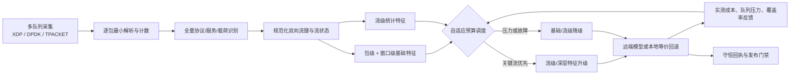

# 高速全流量多粒度特征抽取与自适应预算调度闭环

## 1. 工程结论

系统把可替换的采集后端与不变的特征方法解耦：

1. 生产主路径：`native_af_xdp_zerocopy`；
2. 生产备用路径：`dpdk`；
3. 当前硬件兜底：`current_tpacket_v3_bcm57810`。

生产网卡尚未到位时，第三条路径可以维持采集、识别、特征抽取和预算调度服务，但其回执固定为降级服务连续性证据，不能声明生产吞吐 SLA。未来切换到 XDP 或 DPDK 时，只更换采集所有权；双向流状态、窗口状态、成本/效用 EMA 和熔断恢复状态不重置。

## 2. 闭环处理链



“全流量”采用严格的分层语义：所有成功解析的包都进入基础识别和流状态，所有观察到的流都产生一个特征结果；昂贵的流级升级和载荷深层特征允许按预算选择。解析拒绝、采集丢包、预算跳过和队列失败必须保留在分母中，不能通过抽样或包装器补零隐藏。

## 3. 方法定义

对批次中的流候选 (i)，调度分数定义为边际效用与实测成本之比：

\[
s_{i,t}=\frac{p_i\,\widehat{u}_{t}}{\max(\epsilon,\widehat{c}_{t})},
\]

其中 (p_i) 是流优先级，\(\widehat{u}_{t}\) 和 \(\widehat{c}_{t}\) 分别是特征层级 (t\) 的效用与成本 EMA。有效预算由目标利用率和实际压力共同收缩：

\[
B_{\mathrm{eff}}=B\cdot
\mathrm{clip}\!\left(\frac{\rho_{\mathrm{target}}}
{\max(\rho_{\mathrm{observed}},\epsilon)},r_{\min},r_{\max}\right),
\]

且始终有 (B_{\mathrm{eff}}\le B\)。关键流先预留最低有用层级；普通流和深层特征只能使用剩余软预算。执行完成后以真实 CPU 时间、队列压力和实际效用更新 EMA，而不是只相信计划成本。

当前冻结特征层级如下：

- 包级：长度、载荷长度、协议、端口和 TCP flags；
- 窗口级：窗口包数、字节数及速率；
- 流级：双向包/字节/载荷、持续时间、长度与 IAT 统计、方向统计和 flags；
- 深层：有界载荷样本的熵、可打印比例、零字节比例。

关键流识别与 Rust 热路径保持同一组公共服务端口：21、22、23、25、53、80、110、123、143、443、445、993、995、3389。

完整的 143 列离线契约映射、85 个安全标量、17 组包序列、预算化 Payload/TLS/QUIC、
包交互图和窗口上下文由 `hft_mgbs/unified_feature_reservoir.py` 提供，详见
`docs/UNIFIED_FEATURE_RESERVOIR.md`。该水库与本闭环共享后端代次和流状态，不改变
冻结 A09 的 38→34 维输入路径。

## 4. 必须成立的守恒式

每个批次或原始高性能运行至少重算以下关系：

\[
N_{\mathrm{received}}=N_{\mathrm{parsed}}+N_{\mathrm{rejected}},
\]

\[
N_{\mathrm{parsed}}=N_{\mathrm{recognized}}=N_{\mathrm{packet\ base}},
\]

\[
N_{\mathrm{observed\ flows}}=N_{\mathrm{feature\ results}},
\]

\[
N_{\mathrm{flows\ emitted}}=N_{\mathrm{deep\ selected}}+N_{\mathrm{deep\ deferred}}.
\]

此外，关键流准入结果、远端完成/本地等价完成/终态失败/恢复待处理必须完全守恒；预算越界、采集丢包和解析拒绝超过冻结阈值时，闭环回执立即失败。

## 5. 运行时切换

控制面由以下两个阶段组成：

1. `capture_runtime_failover.py` 根据三个后端的最新能力、连续健康窗和切换拓扑生成只读决策；
2. `capture_runtime_failover_executor.py` 在可信执行计划和显式授权下完成目标预检、启动、健康复核、旧后端停止及失败回滚。

`FullTrafficFeatureSystem.apply_failover_receipt()` 只接受已执行且密封的 v2 回执。切换成功后增加 backend generation，拒绝旧后端的迟到批次，同时保留同一个 `AdaptiveExtractionPipeline`，因此不会在切换边界切断双向流或丢失预算反馈。

## 6. 代码入口

- 统一方法与状态机：`hft_mgbs/full_traffic_feature_loop.py`；
- 冻结策略：`configs/full_traffic_feature_loop_v1.json`；
- 高速原始指标重算：`scripts/audit_full_traffic_feature_loop.py`；
- 采集后端决策/执行：`hft_mgbs/capture_runtime_failover.py`、`hft_mgbs/capture_runtime_failover_executor.py`；
- Rust 全流水线：`rust/hft-capture/src/main.rs` 与 `rust/hft-capture/src/bin/tpacket_v3_full_pipeline.rs`；
- Rust 流特征/预算/回执：`rust/hft-capture/src/flow.rs`、`scheduler.rs`、`metrics.rs`。

对通用 Rust 指标或 TPACKET 外层原始报告执行闭环重算：

```bash
python scripts/audit_full_traffic_feature_loop.py \
  --metrics /absolute/path/raw_metrics.json \
  --policy configs/full_traffic_feature_loop_v1.json \
  --backend current_tpacket_v3_bcm57810 \
  --output /absolute/path/feature_loop_audit.json \
  --require-closed-loop
```

## 7. 资格边界

本次开发闭合的是方法、状态、切换和证据生产代码，不会把未运行的硬件实验写成已通过：

- 当前硬件可作为降级兜底，但不是生产 10/12 Mpps SLA 候选；
- XDP/DPDK 生产线仍须在到货硬件上完成 R0--R4、三次 normal、三次 fallback、资源、恢复及 24/72 小时证据；
- 方法回执固定 `production_sla_qualified=false`、`final_pareto_ingestion_allowed=false`；只有独立硬件与质量发布门可以提升这些状态。
