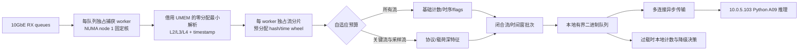

# HFT-MGBS 10 Mpps 工程整改架构

## 结论

当前实现仍不是 10 Mpps 合格架构。最新 R0 证据中，TPACKET/QM 在发生器可提供的
2.794 Mpps 内实现零丢包和 P99/P999 93/126 us；DPDK Q1 的 12 Mpps 请求只达到
最低 TX/RX 2.570/2.569 Mpps，P99 522 us。最后的 stock TCP 多流 Q2 诊断在
1.01 Mpps 零丢包，但 TX 两队均衡而 RX 为 `[15,150,080, 0]`，确认该网卡没有可用
多 RX 扩展路径。更早的完整 XDP 流水线在 0.02 Mpps
时 kernel-XDP-entry-to-feature P99 已为 16.333 ms，0.05 Mpps 约 30--35 ms，
0.5 Mpps 出现抓包丢包和关键流覆盖下降。capture-only 的较高结果不能替代解析、
特征、预算和远端推理门，继续扩大 batch、fill ring 或无界队列也不能形成 10 Mpps
全流水线证据。

10 Mpps 冻结为单个 10GbE 捕获口的 64B 小包主目标；含前导码和 IFG 时约
6.72 Gbps，物理上不超过 10GbE。IMIX/真实包改用 9.5 Gbps 线速门，不强制
不可能的 10 Mpps。

## 当前代码的结构性瓶颈

1. 8 个 XSK RX 队列由一个 Rust 线程轮询。
2. 每包从 UMEM 复制到新 `Vec<u8>`，再组装 owned `PacketBatch`。
3. 抓包、解析、单流表、特征物化和调度串在同一线程。
4. 逐包热路径原有 descriptor/refill 分配和 HashSet 帧跟踪。
5. GPU 节点实际运行 CPU ExtraTrees，单 NDJSON 连接、batch=128，约
   0.10 Mpps 回放时就出现有界队列饱和；它不能承接每包事件。
6. bnx2x 拒绝 native XDP，当前 `xdp-skb` 是 generic XDP copy，不是
   zero-copy。

## 目标数据面

核心原则是“每包基础更新、按预算深解析、按流/窗口推理”。关键流基础特征
不允许被预算丢弃；普通深特征可以采样或降级，但必须计数并进入覆盖率分母。

## 后端策略

优先级按能力而不是名称：

1. 支持 native XDP/AF_XDP zero-copy 的 NIC 上，使用 XDP 原生零拷贝；
2. 当前 bnx2x 专用双口的 DPDK Q1 已在 1 Mpps 正式通过 R0 capture-only，
   但官方 PMD 不支持 RSS/TSS，Q2 实测也只有 queue0 收包；因此它保留为单队列
   对照，不再作为 10/12 Mpps 主候选；
3. 当前硬件最后一个非破坏性高性能候选固定为
   `TPACKET_V3 + PACKET_FANOUT_HASH/QM`；
4. generic `xdp-skb` 保留功能/时间戳诊断，不再作为 10 Mpps 达标的默认
   假设；
5. `af-packet-ts` 继续作为安全回退。

## 分阶段验收

| 阶段 | 内容 | 硬门 |
|---|---|---|
| R0 | capture-only、借用式无逐包复制 | >=12 Mpps，drop=0 |
| R1 | 最小解析 + 分片 packet/byte counters | >=10 Mpps，raw P99<=100 us |
| R2 | 基础流特征 + 自适应预算 | >=10 Mpps，关键流覆盖>=0.99 |
| R3 | 闭合流/窗口远端 A09 + 本地降级 | P99<=10 ms，队列不溢出 |
| R4 | 三重复验、回退压力、24/72h | 全部生产门通过 |

任一阶段失败就停在该阶段定位，不允许用下一阶段结果覆盖前一阶段的丢包。

## Rust 实施顺序

1. 消除 AF_XDP descriptor/refill 分配和稠密 frame id 的 HashSet；
2. 新增借用式 capture-only 探针，量化 generic XDP 原始上限；
3. 将每队列 socket/UMEM 移入独占 worker，并固定到 NUMA node 1 的物理核；
4. 新增零分配最小解析器与每 worker 独占流表；
5. 把深解析和远端 A09 放到有界慢路径，传输改为二进制多连接；
6. 建立 64B 1/5/10/12 Mpps 发生器与分级自动门。

完整目标和门限以 `configs/ten_mpps_engineering_target_v1.json` 为准。

## 当前后端决策（2026-08-13）

| 后端 | 当前证据 | 10/12 Mpps 资格 | 决策 |
| --- | --- | --- | --- |
| native AF_XDP zero-copy | bnx2x 返回 EOPNOTSUPP | 不可用 | 等待可用网卡 |
| generic `xdp-skb` | 1 Mpps R0 通过；当前发生器约 2.8 Mpps 触顶 | 不满足 | 仅诊断/回退验证 |
| DPDK bnx2x Q1 | 1 Mpps 正式通过；12 Mpps 请求只达到最低 TX/RX 2.570/2.569 Mpps，P99 522 us | 不满足 | 当前硬件分支停止 |
| DPDK bnx2x Q2 | stock、256 个 TCP 五元组、TX 两队各 7,575,040；RX `[15,150,080,0]`，P99/P999 11/151 us | 不满足 | 冻结失败并永久停止当前网卡分支 |
| TPACKET_V3 fanout | QM8/IRQ 对齐后 2.794 Mpps 零丢包、P99/P999 93/126 us；发生器仍未达到 12 Mpps | 不满足 | 当前硬件分支停止 |
| `af-packet-ts` | 零丢包诊断与时间戳链已验证 | 不作为主路径 | 安全回退 |

任何 capture-only 结果都不得直接升级为解析、特征、预算、A09 或最终 Pareto 资格。
当前 6 个后端分支已全部裁决、活跃候选为 0；需要更换或新增支持 native AF_XDP
zero-copy 与成熟多队列 RSS/TSS DPDK PMD 的网卡，并使用不共享当前适配器包处理预算
的独立发生器，才能继续 12 Mpps R0。硬件验收合同见
`configs/capture_hardware_upgrade_gate_v1.json`。
