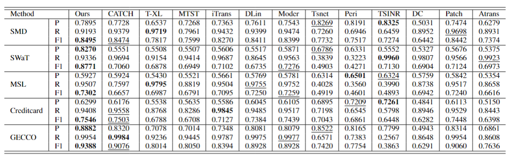

# LaGraph: Laplacian-Guided Graph Learning for Time Series Anomaly Detection

**This code is the official PyTorch implementation of our paper: LaGraph: Laplacian-Guided Graph Learning for Time Series Anomaly Detection.**

If you find this project helpful, please don't forget to give it a ⭐ Star to show your support. Thank you!

## Quickstart

### Installation

Given a python environment (**note**: this project is fully tested under python 3.10), install the dependencies with the following command:

```
pip install -r requirements.txt
```

### Data preparation

Prepare Data. You can obtained the well pre-processed datasets from [GoogleDrive](https://drive.google.com/file/d/1qna2xmdp0JNFbRoNlWzgcIAmbA_2a89a/view?usp=sharing). Then place the downloaded data under the folder `./dataset`. 

### Train and evaluate model

- To see the model structure of LaGraph,  [click here](./ts_benchmark/baselines/self_impl/LaGraph/LaGraph.py).
- We provide the experiment scripts for LaGraph and other baselines under the folder `./scripts/multivariate_detection`. For example you can reproduce a experiment result as the following:

```shell
sh ./scripts/multivariate_detection/detect_label/SMD_script/LaGraph.sh

```


## Results

Extensive experiments on 5 real-world datasets  demonstrate that LaGraph achieves state-of-the-art performance. We show the main results of all the 5 real-world datasets:

<div align="center">

</div>


## Acknowledgements

Special thanks to the following projects:

- [CATCH](https://github.com/decisionintelligence/CATCH): Used their open-source implementation as reference.

