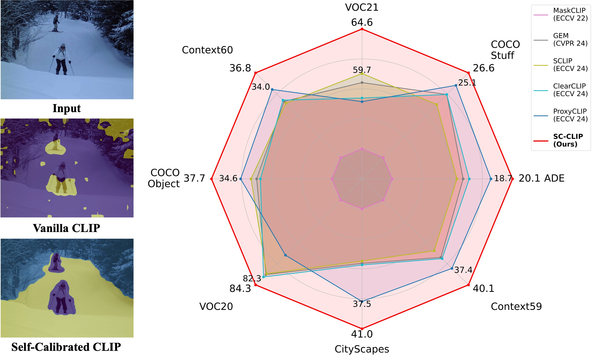

<div align="center">
<h1>  Self-Calibrated CLIP for Training-Free Open-Vocabulary Segmentation [IEEE TIP 2025] </h1>
<div align="center">

</div>
<br>
<a href='https://arxiv.org/abs/2411.15869'></a> 
<a href='https://ieeexplore.ieee.org/document/11291123'></a>
<div>
<a href="https://sulebai.github.io/">Sule Bai*</a>,
<a href="https://yongliu20.github.io/">Yong Liu*</a>,
<a href="https://github.com/LambdaGuard">Yifei Han</a>,
<a href="https://zhang9302002.github.io/">Haoji Zhang</a>,
<a href="https://andytang15.github.io/">Yansong Tang</a>,
<a href="https://scholar.google.com/citations?user=6a79aPwAAAAJ&hl=en">Jie Zhou</a>,
<a href="https://scholar.google.com/citations?user=TN8uDQoAAAAJ&hl=en">Jiwen Lu</a>
</div>
<div>
    Tsinghua University
</div>
</div>

## 🔥 News
* This paper has been accepted by IEEE Transactions on Image Processing (TIP).

## 📖 Overview
1. We propose SC-CLIP, a training-free method designed to enhance CLIP's dense feature representation, effectively addressing the uniform attention activations and feature homogenization caused by the anomaly tokens.
2. We mitigate the negative effects of anomaly tokens from two perspectives. First, we explicitly address the anomaly tokens based on local context. Second, we reduce their impact on normal tokens by enhancing feature discriminability and attention correlation, leveraging the spatial consistency inherent in CLIP's mid-level features.
3. Our approach sets new state-of-the-art results across popular benchmarks. And we conduct extensive experiments to validate the effectiveness of our method.

## 🛠️ Installation

```
git clone https://github.com/SuleBai/SC-CLIP.git
cd SC-CLIP

conda create -n scclip python=3.9
conda activate scclip
pip install torch==1.10.1+cu111 torchvision==0.11.2+cu111 -f https://download.pytorch.org/whl/cu111/torch_stable.html
pip install openmim
mim install mmcv==2.0.1 mmengine==0.8.4 mmsegmentation==1.1.1
pip install ftfy regex numpy==1.26 yapf==0.40.1
```

## 📚 Datasets
We provide the dataset configurations in this repository, following [SCLIP](https://github.com/wangf3014/SCLIP).

Please follow the [MMSeg data preparation document](https://github.com/open-mmlab/mmsegmentation/blob/main/docs/en/user_guides/2_dataset_prepare.md) to download and pre-process the datasets. The COCO-Object dataset can be converted from COCO-Stuff164k by executing the following command:

```
python datasets/cvt_coco_object.py PATH_TO_COCO_STUFF164K -o PATH_TO_COCO_OBJECT
```
## 🔥 Demo
```
python demo.py
```

## 📊 Model Evaluation
Single-GPU running:

```
python eval.py --config configs/cfg_DATASET.py --workdir YOUR_WORK_DIR
```

Multi-GPU running:
```
bash dist_test.sh
```

## 🌹 Acknowledgement
This implementation is based on [CLIP](https://github.com/openai/CLIP), [SCLIP](https://github.com/wangf3014/SCLIP), [CLIP-DINOiser](https://github.com/wysoczanska/clip_dinoiser) and [ClearCLIP](https://github.com/mc-lan/ClearCLIP). Thanks for the awesome work.

## 📃 Bibtex
If this work is helpful for your research, please consider citing the following BibTeX entry.

```
@article{bai2025self,
  title={Self-calibrated clip for training-free open-vocabulary segmentation},
  author={Bai, Sule and Liu, Yong and Han, Yifei and Zhang, Haoji and Tang, Yansong and Zhou, Jie and Lu, Jiwen},
  journal={IEEE Transactions on Image Processing},
  year={2025},
  publisher={IEEE}
}
```