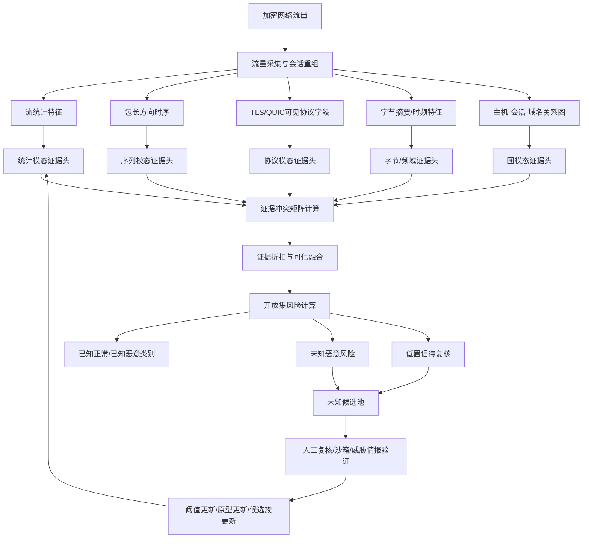

# 证据冲突感知的可信开放集加密恶意流量检测方法及装置：资料收集

## 1. 拟保护主题

**名称建议：** 证据冲突感知的可信开放集加密恶意流量检测方法及装置。

**技术领域：** 网络安全、加密流量分析、开放集识别、多模态证据融合、入侵检测。

**核心构思：** 在不解密载荷的条件下，从流统计、包序列、协议元数据、字节摘要、时频特征和流间关系图中提取多模态证据；每个模态输出类别证据、不确定性和可靠度；通过证据冲突计算、证据折扣融合、原型距离、能量分数和校准阈值联合判断已知类、未知类和待复核类。

**装置模块建议：**

1. 流量采集与会话重组模块。
2. 多粒度特征提取模块。
3. 模态证据生成模块。
4. 证据冲突计算模块。
5. 证据折扣融合模块。
6. 开放集风险判定模块。
7. 未知候选池与人工复核反馈模块。
8. 模型阈值与原型更新模块。

## 2. 支撑文献与可借鉴点

| 编号 | 论文 | 可借鉴点 | 不直接照搬的原因 |
|---:|---|---|---|
| [518] | Reliable Open-Set Network Traffic Classification | 网络流量开放集可靠分类 | 需要扩展到多模态冲突、证据融合和工程闭环 |
| [804] | Trustworthy Detection of Encrypted Malicious Traffic via Uncertainty-Aware Fusion | 不确定性感知融合、可信检测 | 需要补充开放集拒识、未知候选池和复核反馈 |
| [851] | Towards Open Set Deep Networks | OpenMax 和开放集识别基础 | 原场景不是加密恶意流量，也不含多模态证据 |
| [853] | Evidential Deep Learning | Dirichlet evidence 与不确定性 | 需要结合流量模态可靠度和冲突折扣 |
| [855] | Energy-Based OOD Detection | 能量分数用于分布外检测 | 需要与原型距离、证据冲突联合使用 |
| [856] | FOSS | 细粒度未知类检测、开放集攻击谱 | 需要加入多源加密流量模态和在线反馈 |
| [857] | M3S-UPD | 未知模式发现、自监督学习 | 需要嵌入园区检测流程和证据包输出 |
| [858] | New Class Detection | 级联结构和新类发现 | 需要补充多模态证据冲突与校准风险 |
| [685] | Mixed Noisy Labels | 低质量标签、未知加密恶意流量 | 可作为训练样本净化和未知候选维护依据 |

## 3. 现有技术痛点

### 3.1 闭集分类方法的不足

1. 训练和测试默认类别一致，未知攻击族会被强制归入已知类。
2. Softmax 置信度在未知样本上容易过度自信，高分错误分类难以被发现。
3. 多数公开数据集闭集准确率高，但不能反映真实园区网络中新攻击、新业务和协议漂移。

### 3.2 普通开放集和 OOD 方法的不足

1. 仅依赖最大置信度、能量分数或原型距离，单一指标对短流、弱异常、相似攻击变体不稳定。
2. 阈值多由离线验证集确定，面对业务高峰、协议升级和攻击漂移时需要动态校准。
3. 输出通常是 unknown 分数，缺少可解释证据，分析员难以判断为何拒识。

### 3.3 传统多模态融合方法的不足

1. 多采用拼接、attention 或投票，没有显式区分模态缺失、模态污染和模态冲突。
2. 某个模态被噪声污染时，融合模型可能仍给出高置信结论。
3. 未把模态冲突作为未知攻击风险信号，也未形成可复核证据链。

### 3.4 真实部署中的不足

1. 高带宽环境无法对所有流执行全模态深度解析。
2. 标签来源混杂，IDS 告警、沙箱、情报和人工标注存在噪声。
3. 模型缺少未知候选池和反馈更新机制，人工复核结果难以回流。

## 4. 系统流程图



## 5. 关键步骤伪代码

### 5.1 多模态证据生成

```text
Input:
  flow x
  modal set M = {stat, seq, proto, byte, graph}
  evidential heads H_m
Output:
  evidence opinions O = {o_m}

for each modality m in M:
    feature z_m = ExtractFeature(x, m)
    if z_m is missing or quality(z_m) < q_min:
        o_m.belief = uniform_low_belief()
        o_m.uncertainty = 1.0
        o_m.reliability = 0.0
        continue
    evidence e_m = H_m(z_m)
    alpha_m = e_m + 1
    belief_m = e_m / sum(alpha_m)
    uncertainty_m = K / sum(alpha_m)
    reliability_m = CalibrateReliability(z_m, uncertainty_m, quality(z_m))
    o_m = {belief_m, uncertainty_m, reliability_m}
return O
```

### 5.2 证据冲突计算与折扣融合

```text
Input:
  opinions O = {o_m}
  conflict threshold tau_c
  reliability lower bound tau_r
Output:
  fused opinion o_fused
  conflict score C

C = 0
for each pair (i, j) in O:
    pair_conflict = 1 - cosine(o_i.belief, o_j.belief)
    pair_conflict = pair_conflict * (1 - min(o_i.uncertainty, o_j.uncertainty))
    C += pair_conflict
C = C / number_of_pairs

for each modality m:
    discount_m = o_m.reliability * exp(-lambda * conflict_with_others(m))
    if discount_m < tau_r:
        discount_m = 0
    o_m_discounted = DiscountOpinion(o_m, discount_m)

o_fused = DempsterShaferFuse({o_m_discounted})
return o_fused, C
```

### 5.3 开放集风险判定

```text
Input:
  fused opinion o
  embedding h
  class prototypes P
  thresholds tau_unknown, tau_review
Output:
  decision y
  risk package R

p_known = max(o.belief)
u = o.uncertainty
d_proto = min_distance(h, P)
energy = EnergyScore(h)
conflict = o.conflict

unknown_risk = w1 * u + w2 * normalize(d_proto)
             + w3 * normalize(energy)
             + w4 * conflict
             - w5 * p_known

if unknown_risk >= tau_unknown:
    y = "unknown_malicious_candidate"
elif unknown_risk >= tau_review:
    y = "manual_review"
else:
    y = argmax(o.belief)

R = BuildEvidencePackage(o, h, unknown_risk, top_modalities, conflict_pairs)
return y, R
```

### 5.4 阈值与原型在线更新

```text
Input:
  reviewed samples S_review
  known prototypes P
  thresholds tau_unknown, tau_review
  target false alarm rate FAR_target
Output:
  updated P, tau_unknown, tau_review

for sample s in S_review:
    if s.label is known:
        P[s.label] = EMA(P[s.label], embedding(s), beta)
    if s.label is new_unknown_family:
        AddOrUpdateUnknownCluster(s)

recent_far = EstimateFalseAlarmRate(last_window)
recent_unknown_recall = EstimateUnknownRecall(reviewed_window)

if recent_far > FAR_target:
    tau_review += delta_review
    tau_unknown += delta_unknown_small
if recent_unknown_recall < Recall_target:
    tau_unknown -= delta_unknown

ClampThresholds(tau_unknown, tau_review)
return P, tau_unknown, tau_review
```

## 6. 技术效果指标

| 指标类型 | 指标 | 建议记录方式 |
|---|---|---|
| 检测性能 | 已知类 Accuracy、Macro-F1、恶意类 Recall | 按数据集、攻击族、协议类型统计 |
| 开放集性能 | Unknown Recall、AUROC、AUPR、OSCR、FPR@95TPR | 使用攻击族留出和跨数据集未知类评估 |
| 误报漏报 | False Alarm Rate、False Negative Rate | 按业务时间窗和资产组统计 |
| 校准可信 | ECE、Brier Score、Risk-Coverage | 验证不确定性是否可用 |
| 冲突鲁棒 | 模态缺失/污染下性能下降、冲突识别准确率 | 对协议字段缺失、包序列扰动、图邻居稀疏做消融 |
| 吞吐与延迟 | flows/s、Gbps、P50/P95/P99 latency | 区分轻量路径和深度复核路径 |
| 人工复核 | 每日待复核量、复核命中率、未知候选簇纯度 | 衡量复核工作量是否下降 |
| 存储开销 | 每流证据包大小、未知候选池大小 | 保障系统可长期运行 |

## 7. 可替代实施方式

### 7.1 模型替代

1. 序列模态可使用 LSTM、TCN、Transformer、Mamba 或轻量 CNN。
2. 图模态可使用 GCN、GraphSAGE、GAT、动态图 Transformer 或规则化图统计。
3. 证据头可使用 Dirichlet evidence、温度校准 softmax、深度集成或 MC Dropout。
4. 开放集风险可使用 OpenMax、能量分数、Mahalanobis 距离、VAE 重构误差或原型距离。

### 7.2 特征替代

1. 协议字段可使用 TLS 指纹、JA3/JA4、SNI 可见字段、QUIC 传输参数、证书摘要。
2. 包序列可使用包长、方向、时间间隔、burst 特征或 ADU 长度。
3. 字节模态可使用首包字节摘要、n-gram、频域特征或压缩表示。
4. 关系图可使用主机-会话图、会话-域名图、证书共享图或时间共现图。

### 7.3 部署替代

1. 边界网关部署：适合实时初筛和轻量特征提取。
2. 流量镜像分析节点部署：适合深度复核和图构建。
3. SOC 平台部署：适合证据包展示、人工复核和阈值反馈。
4. 边云协同部署：边缘做初筛，中心做模型更新和未知候选聚类。

## 8. 与论文的差异点

1. 不是复现 [518] 的开放集分类器，而是把开放集风险与多模态证据冲突、候选池和反馈更新结合。
2. 不是复现 [804] 的不确定性融合，而是加入冲突矩阵、证据折扣、开放集阈值和工程部署指标。
3. 不是复现 [851]-[855] 的通用 OOD 方法，而是针对加密流量不可见载荷、多模态侧信道和高带宽部署设计。
4. 不是单纯检测 unknown，而是形成“检测结果 + 冲突原因 + 模态证据 + 相似样本 + 人工复核入口”的闭环。
5. 相比论文实验，本方案强调在线阈值更新、未知候选池维护、人工反馈回流和吞吐/延迟约束，可更适合写成方法及装置权利要求。

## 9. 交底书下一步补充

1. 明确各模态特征字段表。
2. 给出证据冲突矩阵的计算公式和折扣函数。
3. 画装置模块框图和数据流图。
4. 准备至少 2 组对比实验：闭集分类器 vs 开放集基线 vs 本方案。
5. 准备工程指标：吞吐、延迟、每流证据包大小、人工复核量下降比例。

