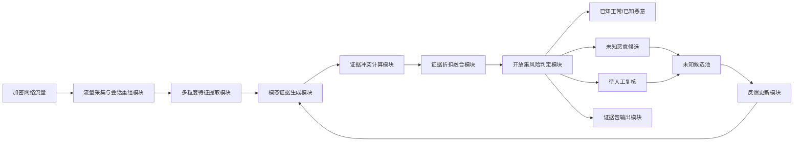
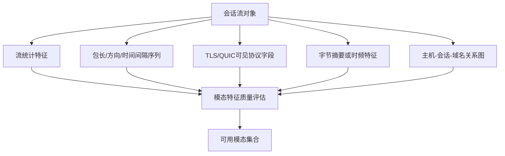
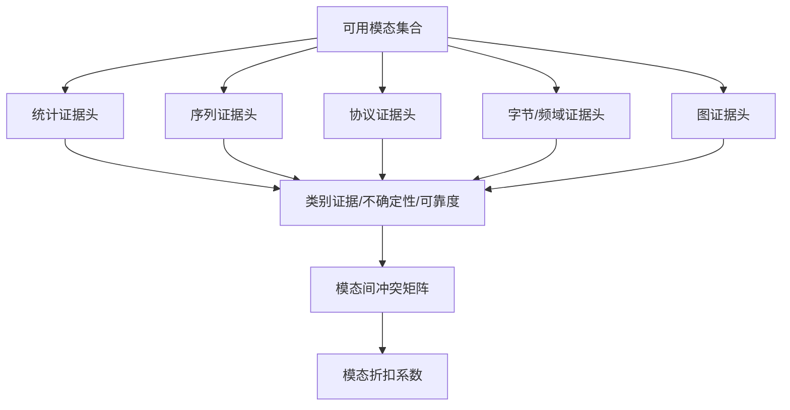
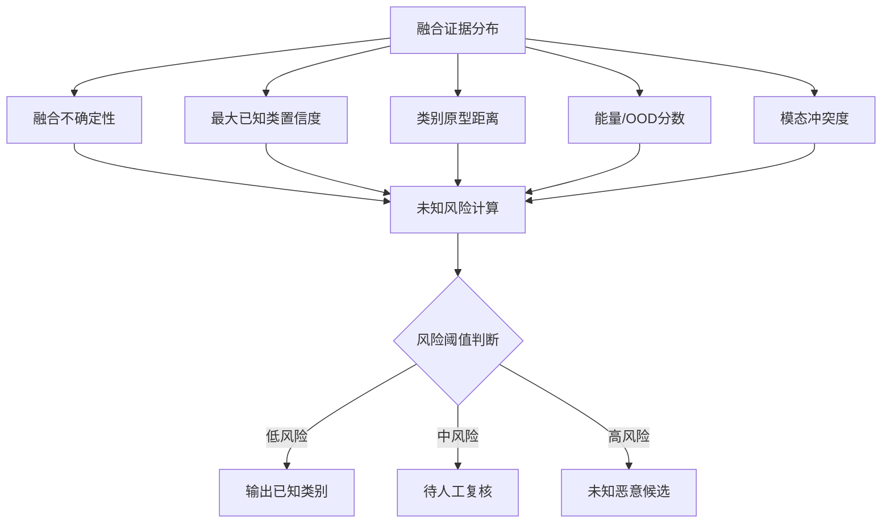
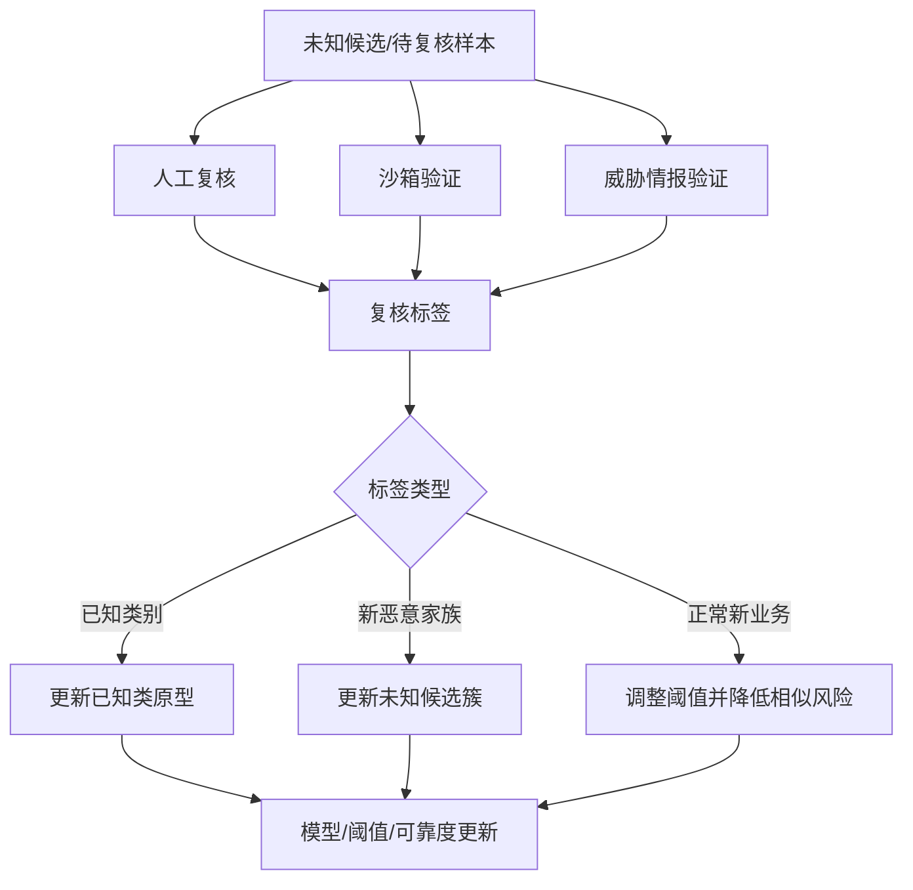
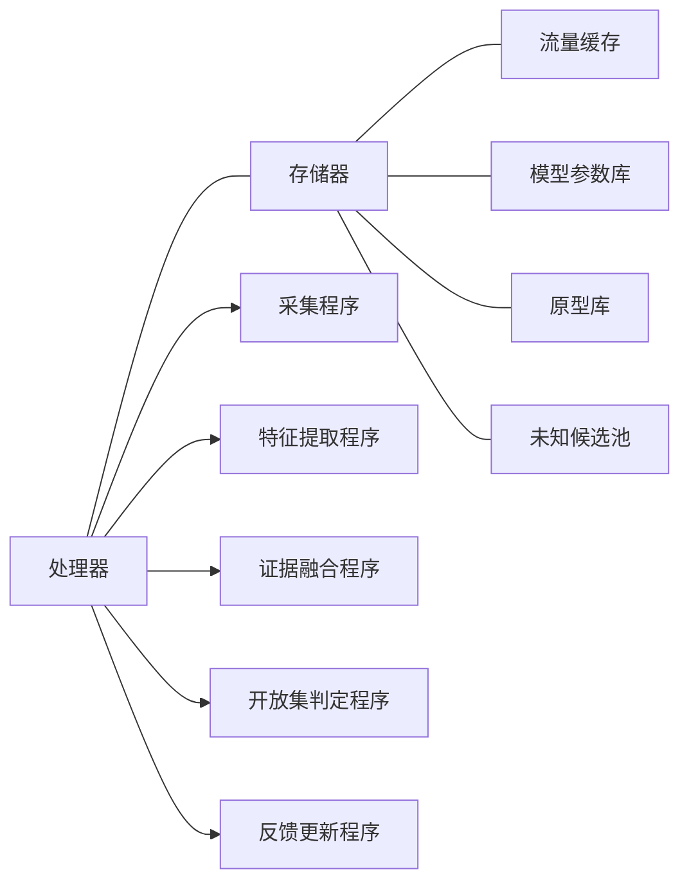

# 附图与流程说明：证据冲突感知的可信开放集加密恶意流量检测方法及装置

## 图1 系统总体架构图

**说明：** 图1展示装置的整体结构。多粒度特征提取模块为后续模态证据生成提供输入；证据冲突计算模块和证据折扣融合模块共同实现可信融合；开放集风险判定模块输出分类结果、未知风险和待复核状态；反馈更新模块根据复核结果更新模型参数、阈值和原型。

## 图2 多粒度特征提取流程图

**说明：** 图2展示不同粒度的特征来源。若某一模态缺失或质量低于阈值，该模态仍可生成高不确定性意见，而非直接造成流程中断。

## 图3 模态证据生成与冲突计算流程图

**说明：** 图3展示每个模态分别输出证据意见，再计算模态之间的冲突关系。冲突矩阵用于识别互相矛盾的模态对，并影响后续融合时的折扣系数。

## 图4 开放集风险判定流程图

**说明：** 图4展示开放集判定过程。未知风险不是由单一置信度决定，而是由不确定性、冲突度、原型距离、能量分数和置信度共同确定。

## 图5 反馈更新闭环图

**说明：** 图5展示系统闭环。复核结果不仅用于记录，还会更新原型、未知候选簇和阈值，使系统逐步适应真实网络变化。

## 图6 装置模块框图

**说明：** 图6用于装置类描述。装置可以实现为服务器、流量探针、网关设备或 SOC 平台中的一个功能组件。

## 附图编号建议

| 图号 | 名称 | 对应内容 |
|---|---|---|
| 图1 | 系统总体架构图 | 装置模块与主流程 |
| 图2 | 多粒度特征提取流程图 | 输入特征来源 |
| 图3 | 模态证据生成与冲突计算流程图 | 证据、可靠度、冲突矩阵 |
| 图4 | 开放集风险判定流程图 | unknown 风险计算 |
| 图5 | 反馈更新闭环图 | 未知候选池和复核更新 |
| 图6 | 装置模块框图 | 处理器、存储器和功能程序 |

