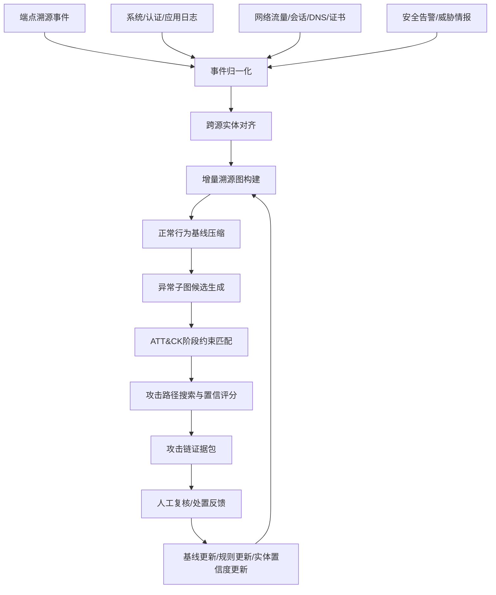

# 端点溯源图、日志和网络流联合的 APT 攻击链重构方法及装置：资料收集

## 1. 拟保护主题

**名称建议：** 端点溯源图、日志和网络流联合的 APT 攻击链重构方法及装置。

**技术领域：** 高级持续性威胁检测、端点溯源分析、日志分析、网络流量关联、攻击链重构。

**核心构思：** 将端点进程、文件、注册表、账号、系统日志、认证日志、网络流、域名、证书和告警统一映射为跨源事件图；通过时间因果关系、主机资产关系、网络通信关系和 ATT&CK 阶段约束抽取攻击链；用正常行为基线压缩高频正常边，保留异常边和关键证据，输出可复核的 APT 攻击路径。

**装置模块建议：**

1. 端点事件采集模块。
2. 日志解析与事件归一化模块。
3. 网络流关联模块。
4. 跨源实体对齐模块。
5. 溯源图构建与增量更新模块。
6. 正常行为基线压缩模块。
7. 攻击阶段识别与路径搜索模块。
8. 攻击链证据输出与反馈模块。

## 2. 支撑文献与可借鉴点

| 编号 | 论文 | 可借鉴点 | 不直接照搬的原因 |
|---:|---|---|---|
| [336] | A dynamic provenance graph-based detector for APT | 动态溯源图 APT 检测 | 需要扩展到日志和网络流联合重构 |
| [416] | End-to-End Attack Scene Reconstruction | 攻击场景重构、规则与异常模型结合 | 需要加入跨源实体对齐和阶段约束 |
| [528] | RT-APT | 大规模溯源图实时 APT 检测 | 需要补充可复核攻击链输出 |
| [557] | TeRed | 正常行为驱动的溯源图压缩 | 需要与日志、流量图、ATT&CK 结合 |
| [847] | Zoomer | APT TTP 识别、深宽溯源图学习 | 需要形成端到端系统流程和反馈闭环 |
| [109] | KRYSTAL | 审计数据中的知识图谱攻击发现 | 可作为战术攻击发现和知识约束参考 |
| [604] | Alert2Vec | 告警子图表示与聚合 | 可用于告警疲劳抑制和事件聚合 |

## 3. 现有技术痛点

### 3.1 单一端点溯源方法的不足

1. 仅依赖主机事件，难以发现跨主机横向移动、远程 C2 和数据外传。
2. 溯源图规模巨大，高频正常行为边会淹没攻击路径。
3. 输出多为异常节点或异常分数，缺少完整攻击链和阶段化解释。

### 3.2 单一日志分析方法的不足

1. 日志字段异构，Windows、Linux、EDR、认证、应用日志格式不统一。
2. 日志缺失或采样会导致因果链断裂。
3. 规则检索依赖专家经验，对变体攻击和低频行为泛化不足。

### 3.3 单一网络流量检测方法的不足

1. 网络流能看到通信关系，但难以解释本地进程、文件和账号行为。
2. 加密流量载荷不可见，难以直接判定攻击意图。
3. 单条流异常不能说明攻击阶段，容易造成孤立告警。

### 3.4 现有攻击链重构系统的不足

1. 跨源实体对齐不足，同一账号、进程、IP、域名、会话难以统一。
2. 攻击阶段识别缺少 ATT&CK 或任务链约束，路径搜索容易产生大量噪声。
3. 人工研判结果难以回写到图谱、基线和检测规则。

## 4. 系统流程图



## 5. 关键步骤伪代码

### 5.1 跨源事件归一化与实体对齐

```text
Input:
  endpoint events E_host
  logs E_log
  network flows E_flow
  threat intel E_ioc
Output:
  normalized event stream S
  entity map M

for event e in union(E_host, E_log, E_flow, E_ioc):
    e_norm = NormalizeSchema(e)
    entities = ExtractEntities(e_norm)
    for entity v in entities:
        key_candidates = GenerateKeys(v)
        matched = MatchEntity(key_candidates, M, time_window, asset_context)
        if matched.confidence >= tau_entity:
            M.update(matched.entity_id, v, e.source)
        else:
            M.create_new(v, e.source)
    S.append(e_norm with entity_ids)
return S, M
```

### 5.2 溯源图增量更新

```text
Input:
  normalized events S_t in time window t
  provenance graph G
Output:
  updated graph G

for event e in S_t:
    subject = e.actor_entity
    object = e.object_entity
    relation = InferRelation(e)
    timestamp = e.time
    edge = (subject, relation, object, timestamp)

    if EdgeExists(G, edge, delta_time):
        UpdateEdgeStats(G, edge)
    else:
        AddEdge(G, edge)

    UpdateNodeState(G, subject, e)
    UpdateNodeState(G, object, e)

RemoveOrArchiveExpiredEdges(G, retention_policy)
return G
```

### 5.3 正常行为基线压缩

```text
Input:
  graph G
  baseline B
  compression threshold tau_base
Output:
  compressed graph Gc

Gc = empty_graph()
for edge e in G.edges:
    normal_score = BaselineMatch(B, e)
    risk_score = EdgeRisk(e)
    if normal_score >= tau_base and risk_score < tau_risk:
        summary_node = GetOrCreateSummaryNode(Gc, e.subject, e.relation_type)
        AggregateEdge(summary_node, e)
    else:
        AddEdge(Gc, e)

for node v in G.nodes:
    if IsSensitiveNode(v) or HasAnomalousNeighbor(v):
        AddNode(Gc, v)
return Gc
```

### 5.4 攻击阶段识别与路径搜索

```text
Input:
  compressed graph Gc
  ATT&CK stage graph A
  anomaly scores score(v), score(e)
Output:
  ranked attack chains C

candidates = GenerateSuspiciousSubgraphs(Gc, seed_nodes, time_window)
C = []
for subgraph sg in candidates:
    stage_probs = {}
    for event_node n in sg.nodes:
        stage_probs[n] = MapToAttackStage(n, A)

    paths = TemporalCausalSearch(sg, max_length=L, max_gap=T_gap)
    for path p in paths:
        stage_consistency = CheckStageOrder(p, stage_probs, A)
        evidence_score = SumEvidence(p)
        compactness = PathCompactness(p)
        chain_score = a*stage_consistency + b*evidence_score + c*compactness
        if chain_score >= tau_chain:
            C.append({path:p, score:chain_score, stages:stage_probs})

return SortByScore(C)
```

### 5.5 反馈更新

```text
Input:
  reviewed chains C_review
  baseline B
  rules R
Output:
  updated B, R

for chain c in C_review:
    if c.label == true_attack:
        PromoteEdgesAsSuspiciousPatterns(c.key_edges)
        UpdateRuleCandidates(R, c.indicators, c.stages)
    elif c.label == benign:
        UpdateNormalBaseline(B, c.repeated_edges)
        LowerRiskForContext(c.asset_group, c.relation_types)
    else:
        MarkAsUnknownInvestigation(c)

RecalculateEntityConfidence()
return B, R
```

## 6. 技术效果指标

| 指标类型 | 指标 | 建议记录方式 |
|---|---|---|
| 检测性能 | APT 事件 Recall、Precision、F1、PR-AUC | 按攻击阶段和场景统计 |
| 攻击链质量 | 路径完整率、阶段识别准确率、关键节点召回率 | 与人工标注攻击链对比 |
| 图压缩效果 | 节点压缩率、边压缩率、压缩后攻击边保留率 | 重点证明 TeRed 类思想在本系统中的工程价值 |
| 实时性能 | 每秒事件处理数、P95 延迟、图更新时间 | 分端点数量和事件量统计 |
| 误报控制 | 每日事件簇数量、误报率、重复告警压缩率 | 面向 SOC 工作量 |
| 证据质量 | 每条攻击链证据覆盖度、缺失环节数、证据来源数 | 证明可审计 |
| 资源开销 | 图存储大小、内存峰值、CPU/GPU 占用 | 对比未压缩溯源图 |
| 反馈收益 | 复核后误报下降率、规则命中率提升 | 衡量闭环价值 |

## 7. 可替代实施方式

### 7.1 数据源替代

1. 端点事件可来自 EDR、Sysmon、Linux auditd、eBPF 或主机代理。
2. 日志可包括认证日志、DNS 日志、代理日志、防火墙日志、应用日志。
3. 网络数据可包括 NetFlow/IPFIX、Zeek 日志、PCAP 摘要、TLS/QUIC 元数据。
4. 情报可包括 IOC、漏洞信息、资产画像、MITRE ATT&CK 技术标签。

### 7.2 图模型替代

1. 规则因果图：适合可解释和低成本部署。
2. 异构图神经网络：适合复杂实体关系学习。
3. 动态图 Transformer：适合长时间跨度攻击链建模。
4. 子图检索加排序模型：适合 SOC 快速检索。

### 7.3 攻击阶段识别替代

1. 可使用 ATT&CK 阶段约束。
2. 可使用企业自定义 kill chain。
3. 可使用专家规则、图匹配、序列模型或大模型辅助解释。
4. 可按资产组、业务系统、攻击类型配置不同阶段模板。

### 7.4 部署替代

1. 主机侧轻量代理做事件采集和初步压缩。
2. 安全数据湖做跨源图构建。
3. SOC 平台做攻击链展示和人工复核。
4. 边缘节点做分区图，中心节点做跨域攻击链合并。

## 8. 与论文的差异点

1. 不是复现 [336] 的动态溯源图检测，而是融合日志、网络流、威胁情报和告警形成跨源攻击链。
2. 不是复现 [416] 的单主机攻击场景重构，而是强调端点、日志和网络流联合，以及跨主机路径搜索。
3. 不是复现 [528] 的实时 APT 检测器，而是补充正常基线压缩、阶段约束和证据包输出。
4. 不是复现 [557] 的图压缩方法，而是将压缩作为攻击链重构前置工程模块，并要求保留攻击证据边。
5. 不是复现 [847] 的 TTP 识别模型，而是把 TTP 识别嵌入完整检测、重构、复核、反馈闭环。

## 9. 交底书下一步补充

1. 明确统一事件 schema 和实体类型表。
2. 给出实体对齐置信度计算公式。
3. 画跨源图数据结构示意图。
4. 准备一个 APT 攻击链样例，标出初始访问、执行、横向移动、C2、外传。
5. 用实验数据证明图压缩率、攻击边保留率和分析员复核量下降。

