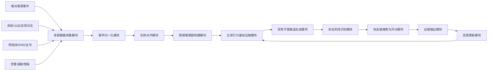
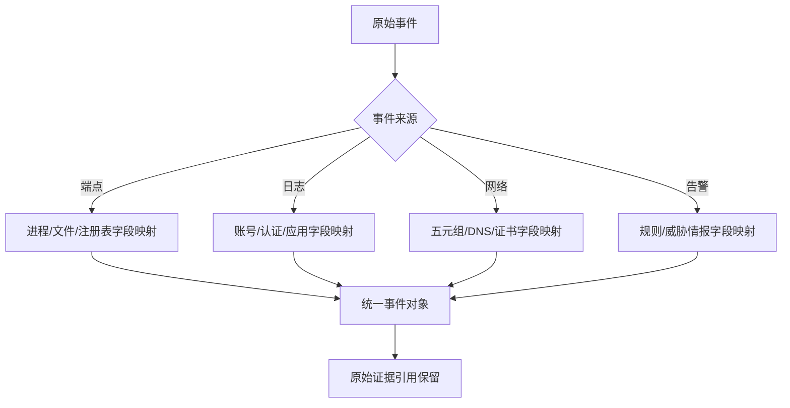
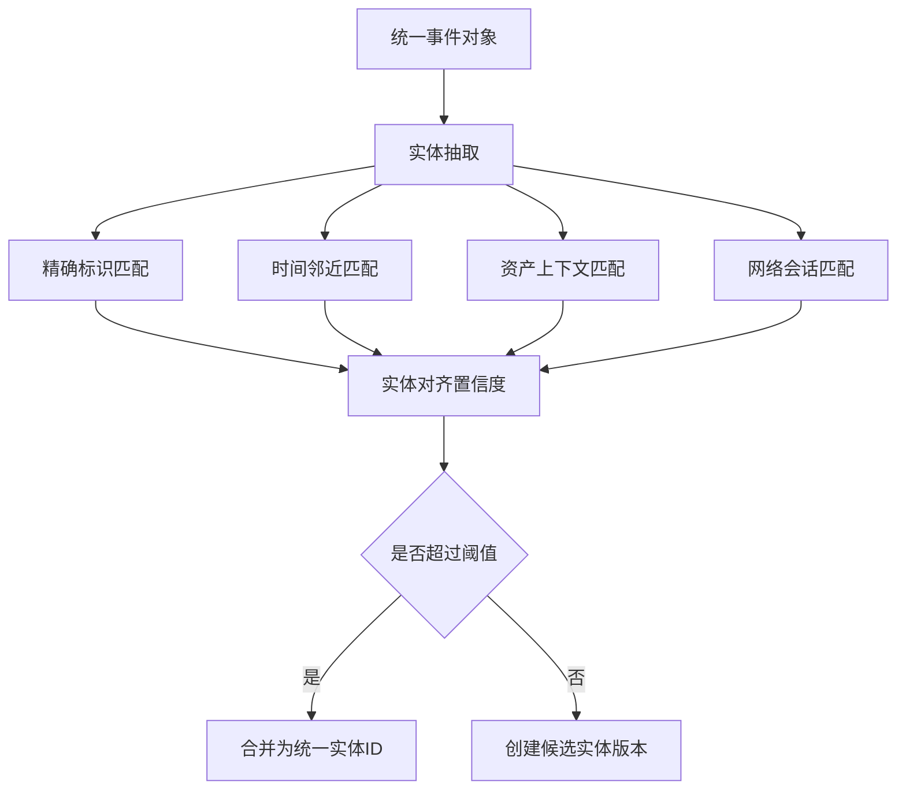
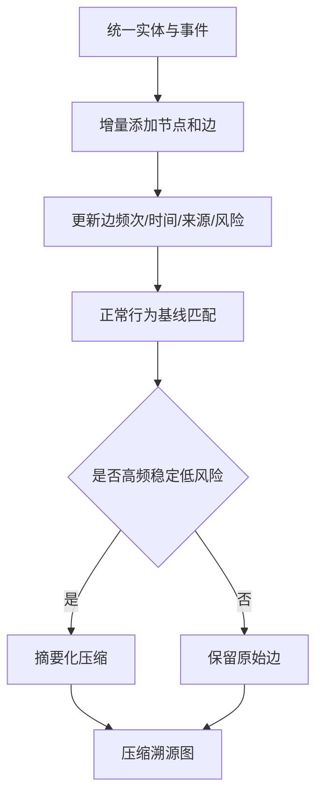
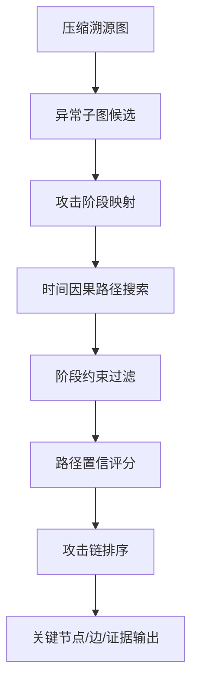
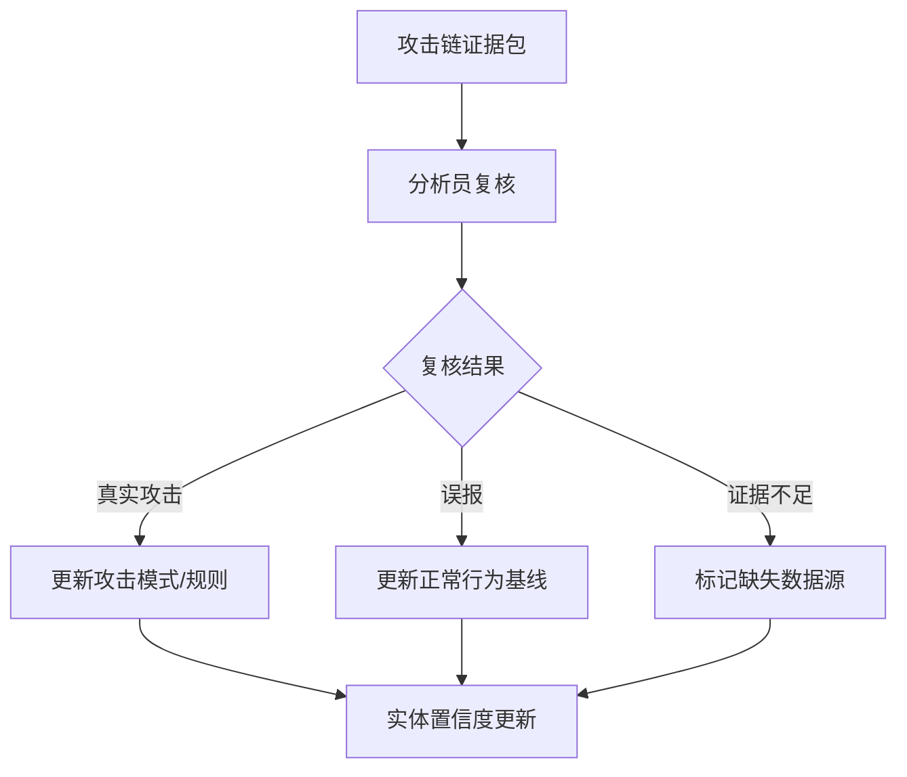

# 附图与流程说明：端点溯源图、日志和网络流联合的 APT 攻击链重构方法及装置

## 图1 系统总体架构图

**说明：** 图1展示从多源事件进入系统，到最终输出攻击链并反馈更新的完整流程。

## 图2 跨源事件归一化流程图

**说明：** 图2展示不同数据源如何映射到统一事件对象。统一事件对象保留原始证据引用，便于审计和复核。

## 图3 实体对齐流程图

**说明：** 图3展示实体对齐流程。对低置信实体不强制合并，而是保留候选版本，减少错误合并。

## 图4 溯源图构建与压缩流程图

**说明：** 图4展示压缩机制。正常边被摘要化，攻击相关边、敏感边和异常边被保留。

## 图5 攻击链搜索流程图

**说明：** 图5展示从异常子图到攻击链的搜索过程。攻击阶段约束用于过滤不符合攻击逻辑的路径。

## 图6 反馈更新闭环图

**说明：** 图6展示复核反馈如何回写系统。真实攻击推动规则沉淀，误报推动正常基线更新，证据不足推动数据源补强。

## 附图编号建议

| 图号 | 名称 | 对应内容 |
|---|---|---|
| 图1 | 系统总体架构图 | 多源采集到攻击链输出 |
| 图2 | 跨源事件归一化流程图 | 原始事件到统一事件对象 |
| 图3 | 实体对齐流程图 | 统一实体 ID 生成 |
| 图4 | 溯源图构建与压缩流程图 | 增量图构建和正常边压缩 |
| 图5 | 攻击链搜索流程图 | 异常子图、阶段映射、路径搜索 |
| 图6 | 反馈更新闭环图 | 人工复核和基线规则更新 |

