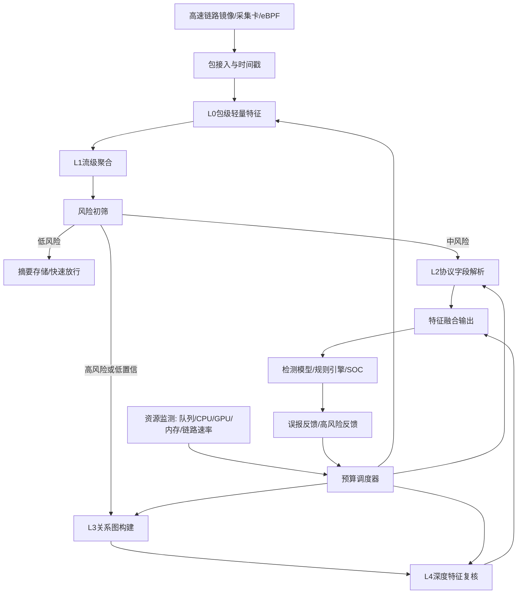

# 高速全流量多粒度特征抽取与自适应预算调度方法及装置：资料收集

## 1. 拟保护主题

**名称建议：** 高速全流量多粒度特征抽取与自适应预算调度方法及装置。

**技术领域：** 高速网络测量、全流量采集、协议解析、加密流量识别、流式入侵检测。

**核心构思：** 将全流量特征按计算成本划分为包级、流级、会话级、协议字段级、关系图级和深度特征级；实时监测链路速率、队列长度、CPU/GPU 负载、内存和初筛风险；根据资源预算和风险等级动态选择特征抽取路径，使高风险流获得深度解析，低风险流只保留轻量摘要。

**装置模块建议：**

1. 高速流量接入与时间戳模块。
2. 包级轻量特征提取模块。
3. 流级与会话级聚合模块。
4. 协议字段解析模块。
5. 多粒度关系图构建模块。
6. 风险初筛模块。
7. 预算调度与队列管理模块。
8. 深度特征复核模块。
9. 特征缓存、输出与反馈模块。

## 2. 支撑文献与可借鉴点

| 编号 | 论文 | 可借鉴点 | 不直接照搬的原因 |
|---:|---|---|---|
| [256] | Marina: Realizing ML-Driven Real-Time Network Traffic Monitoring at Terabit Scale | Terabit 级实时流量监测 | 需要扩展自适应特征预算和多粒度安全检测 |
| [619] | BPF-DAG | 字节-包-流动态属性图融合 | 需要加入高速在线调度和资源约束 |
| [832] | HTTPS classification using restored ADU length | 应用数据单元长度恢复 | 需要作为高成本协议语义特征的一部分 |
| [835] | UniNet | 统一多粒度流量建模 | 需要落到全流量流水线和调度装置 |
| [503] | NTLFlowLyzer | 网络/传输层特征抽取和画像 | 可作为基础特征工程参考 |
| [766] | NOS-Gate | 队列感知流式 IDS | 可借鉴队列状态进入检测和调度 |
| [615] | Hybrid data-control plane DDoS defense | 数据平面与控制平面协同 | 可用于高速链路处置闭环 |

## 3. 现有技术痛点

### 3.1 全量深度解析不可扩展

1. 高速链路下无法对每条流都执行完整协议解析、图构建和深度模型推理。
2. 深度解析带来高 CPU/GPU 开销和内存压力，容易造成队列积压。
3. 固定抽样或固定特征集不能根据流量高峰和攻击突发自适应调整。

### 3.2 轻量特征检测能力不足

1. 仅依赖五元组、包长、方向和统计特征，对弱异常和加密应用区分不足。
2. 低成本特征缺少协议语义，难以识别 HTTPS/QUIC 场景中的应用行为。
3. 单流特征无法刻画多流协同、扫描扩散和 C2 周期关系。

### 3.3 现有多粒度模型缺少工程调度

1. 论文中多粒度特征常默认离线可用，未考虑实时特征提取成本。
2. 字节、包、流、图特征处理链路割裂，重复计算和存储较多。
3. 缺少根据风险、负载和队列状态选择检测路径的机制。

### 3.4 真实部署指标不足

1. 许多方法只报告准确率，不报告吞吐、延迟、丢包、内存和特征提取耗时。
2. 在攻击流量突发时，检测队列拥塞会影响安全效果。
3. 低风险流量存储过多会增加长期留存成本。

## 4. 系统流程图



## 5. 关键步骤伪代码

### 5.1 多粒度特征分层

```text
Feature levels:
  L0: packet length, direction, timestamp, 5-tuple
  L1: flow statistics, burst pattern, inter-arrival time
  L2: TLS/QUIC/DNS/HTTP visible fields, ADU length
  L3: host-flow-domain-certificate relationship graph
  L4: byte summary, sequence model embedding, graph embedding
```

### 5.2 预算调度主循环

```text
Input:
  packet stream P
  resource state R = {queue_len, cpu, gpu, memory, link_rate}
  budget B = {max_latency, max_cpu, max_gpu, max_queue}
Output:
  feature records F

for packet p in P:
    flow_id = GetFlowId(p)
    UpdateL0(flow_id, p)

    if IsFlowWindowReady(flow_id):
        l1 = BuildL1(flow_id)
        risk0, confidence0 = FastRiskScreen(l1)
        R = ReadResourceState()
        path = SelectFeaturePath(risk0, confidence0, R, B)

        if path == "summary_only":
            F.append(BuildSummary(flow_id, L0, L1))
        elif path == "protocol_parse":
            l2 = ExtractProtocolFields(flow_id)
            F.append(Merge(L0, L1, l2))
        elif path == "graph_review":
            l2 = ExtractProtocolFields(flow_id)
            l3 = UpdateAndExtractGraph(flow_id)
            F.append(Merge(L0, L1, l2, l3))
        elif path == "deep_review":
            l2 = ExtractProtocolFields(flow_id)
            l3 = UpdateAndExtractGraph(flow_id)
            l4 = DeepEmbedding(flow_id)
            F.append(Merge(L0, L1, l2, l3, l4))
return F
```

### 5.3 特征路径选择

```text
Input:
  risk r
  confidence c
  resource state R
  budget B
Output:
  feature path

overload = R.queue_len > B.max_queue or R.cpu > B.max_cpu or R.memory > B.max_memory

if overload:
    if r >= tau_high:
        return "protocol_parse"
    else:
        return "summary_only"

if r < tau_low and c >= tau_conf:
    return "summary_only"
if r < tau_mid:
    return "protocol_parse"
if r < tau_high:
    return "graph_review"
return "deep_review"
```

### 5.4 队列感知的高风险优先调度

```text
Input:
  flow tasks T
  queue capacity C
Output:
  scheduled tasks T_s

for task t in T:
    t.priority = a*t.risk + b*t.uncertainty + c*t.asset_value - d*t.feature_cost
    if IsTimingEvasionSuspected(t):
        t.priority += evasion_bonus

SortByPriority(T)
T_s = []
while QueueUsage() < C and T not empty:
    t = PopHighestPriority(T)
    if PredictedLatency(t) <= latency_budget:
        T_s.append(t)
    else:
        DowngradeFeatureLevel(t)
        T_s.append(t)
return T_s
```

### 5.5 关系图增量更新

```text
Input:
  flow f
  graph G
Output:
  graph features g_f

nodes = {src_host, dst_host, dst_domain, certificate, ja3, quic_param}
for v in nodes:
    AddOrUpdateNode(G, v)

edges = BuildEdgesByRelation(nodes, relations={
    "communicates_with",
    "uses_certificate",
    "shares_fingerprint",
    "co_occurs_in_window"
})
for e in edges:
    AddOrUpdateEdge(G, e, time_decay=True)

g_f = ExtractLocalSubgraphFeatures(G, src_host, dst_host, window=W)
PruneExpiredGraph(G, ttl)
return g_f
```

## 6. 技术效果指标

| 指标类型 | 指标 | 建议记录方式 |
|---|---|---|
| 吞吐 | packets/s、flows/s、Gbps/Tbps | 按链路速率和采样策略记录 |
| 延迟 | P50/P95/P99 特征提取延迟、检测总延迟 | 分 summary、protocol、graph、deep 四条路径 |
| 队列稳定 | 最大队列长度、平均等待时间、丢弃率 | 高峰期和攻击突发期单独统计 |
| 资源占用 | CPU、GPU、内存、磁盘写入量 | 与固定全特征方案对比 |
| 检测效果 | Recall、Precision、F1、误报率、漏报率 | 按风险路径分组统计 |
| 开放集效果 | Unknown Recall、FPR@95TPR、AUROC | 用未知协议、未知应用或未知攻击族评估 |
| 特征成本 | 每流特征字节数、每流解析耗时 | 证明低风险流摘要化收益 |
| 预算收益 | 深度解析调用减少比例、总算力节省比例 | 对比所有流深度解析 |

## 7. 可替代实施方式

### 7.1 采集方式替代

1. DPDK、PF_RING、XDP/eBPF、网卡硬件时间戳、交换机镜像。
2. NetFlow/IPFIX 摘要采集或 PCAP 分片采集。
3. 边缘网关采集或中心流量探针采集。

### 7.2 特征层级替代

1. L0/L1 可加入 sketch、count-min、heavy hitter、burst 指纹。
2. L2 可加入 DNS、SNI、证书、JA3/JA4、QUIC transport parameters。
3. L3 可使用主机图、会话图、域名图、证书图。
4. L4 可使用 Transformer、TCN、Mamba、图神经网络或轻量自编码器。

### 7.3 调度策略替代

1. 基于阈值的规则调度。
2. 基于强化学习的预算调度。
3. 基于排队论的延迟约束调度。
4. 基于风险覆盖曲线的动态阈值调度。

### 7.4 部署替代

1. 边界网关上只运行 L0-L1。
2. 专用分析服务器运行 L2-L4。
3. SOC 中心运行图聚合和历史复核。
4. 云端训练预算策略，边缘部署轻量策略。

## 8. 与论文的差异点

1. 不是复现 [256] 的 Terabit 监测系统，而是在高速监测基础上加入安全风险驱动的特征预算调度。
2. 不是复现 [619] 的 BPF-DAG，而是将字节-包-流图作为可选高成本路径，并受队列和资源预算控制。
3. 不是复现 [832] 的 ADU 长度特征，而是把 ADU 恢复纳入协议语义特征层，并只对必要流调用。
4. 不是复现 [835] 的统一多粒度建模，而是形成全流量采集、特征分层、调度、检测、反馈的装置流程。
5. 与普通论文不同，本方案的关键是工程约束：吞吐、延迟、队列长度、资源占用和低风险流摘要化存储。

## 9. 交底书下一步补充

1. 给出各层特征字段和计算成本表。
2. 给出调度阈值的默认取值和更新方式。
3. 准备特征路径状态机图。
4. 准备固定全特征、固定轻量特征、自适应预算三组对比实验。
5. 明确装置可部署在采集探针、网关、旁路分析节点或 SOC 中心。

