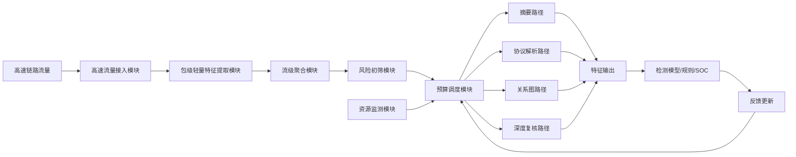
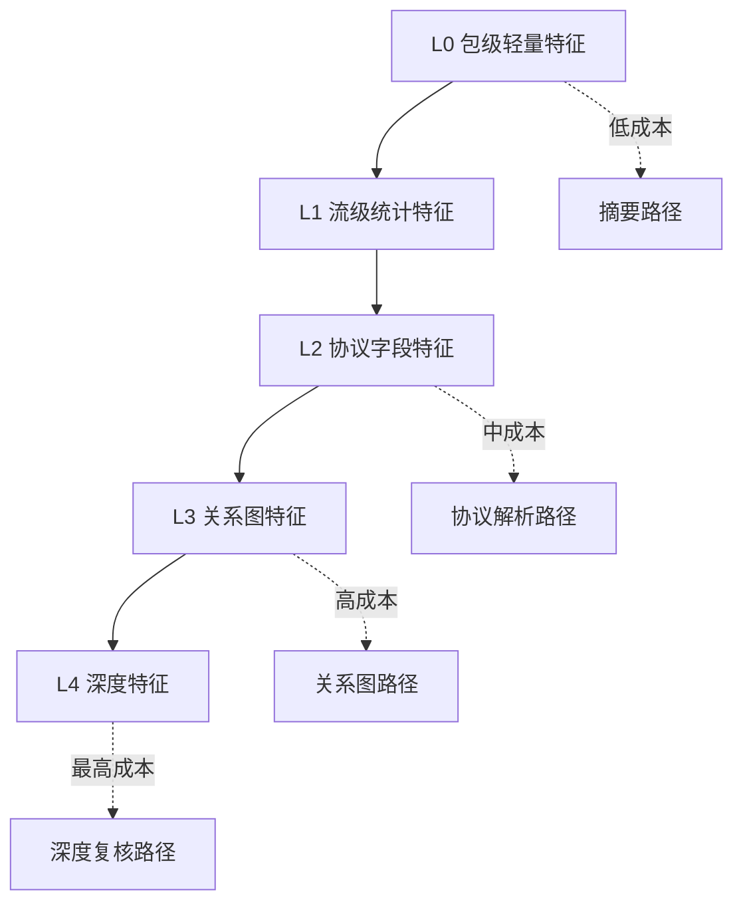
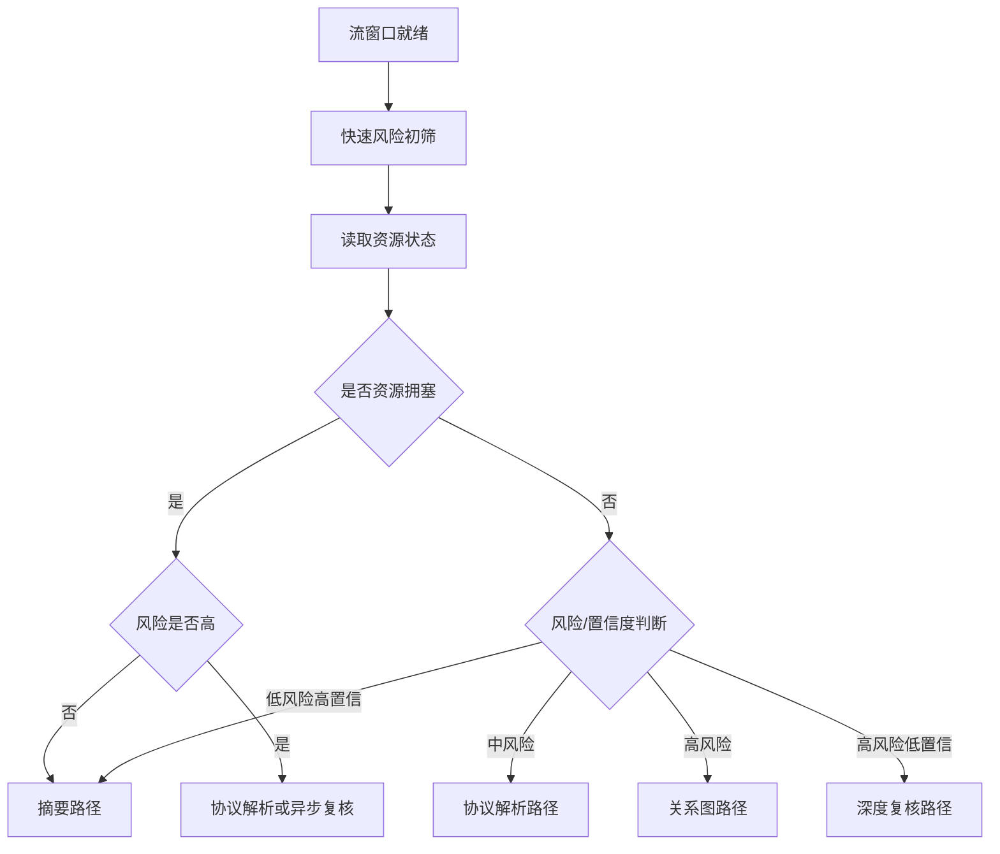
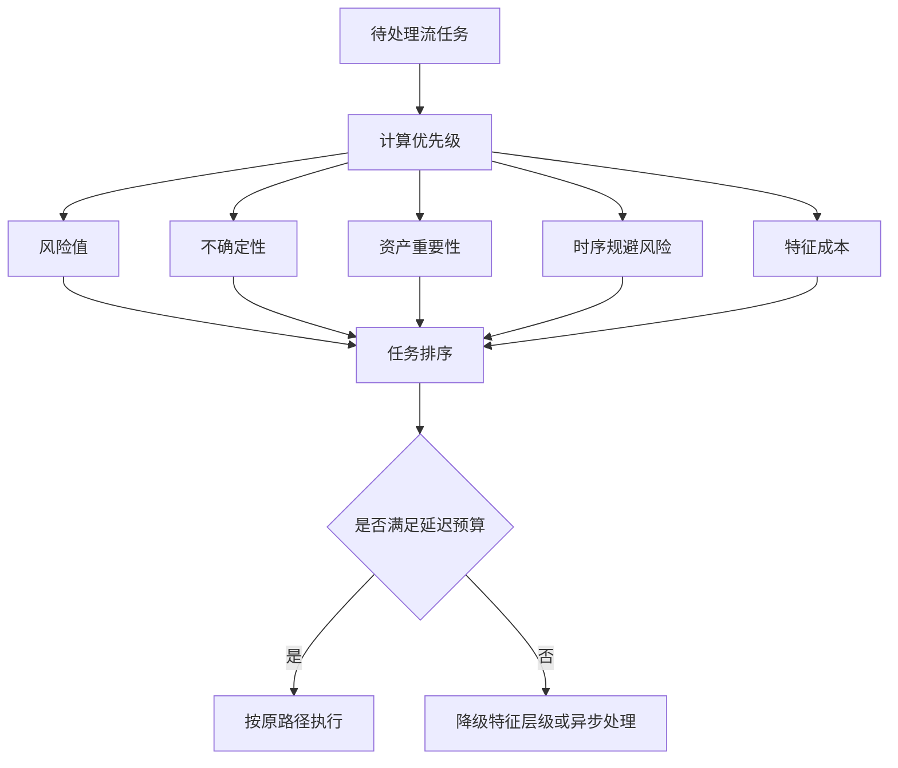
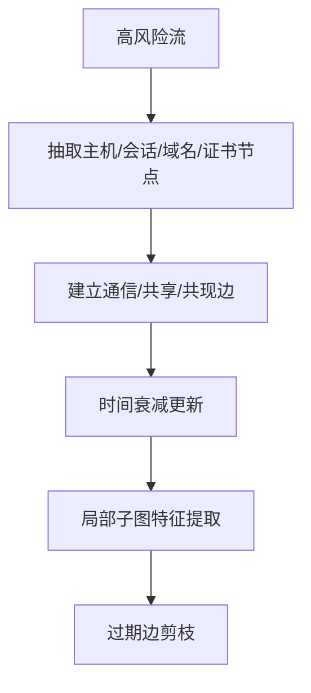
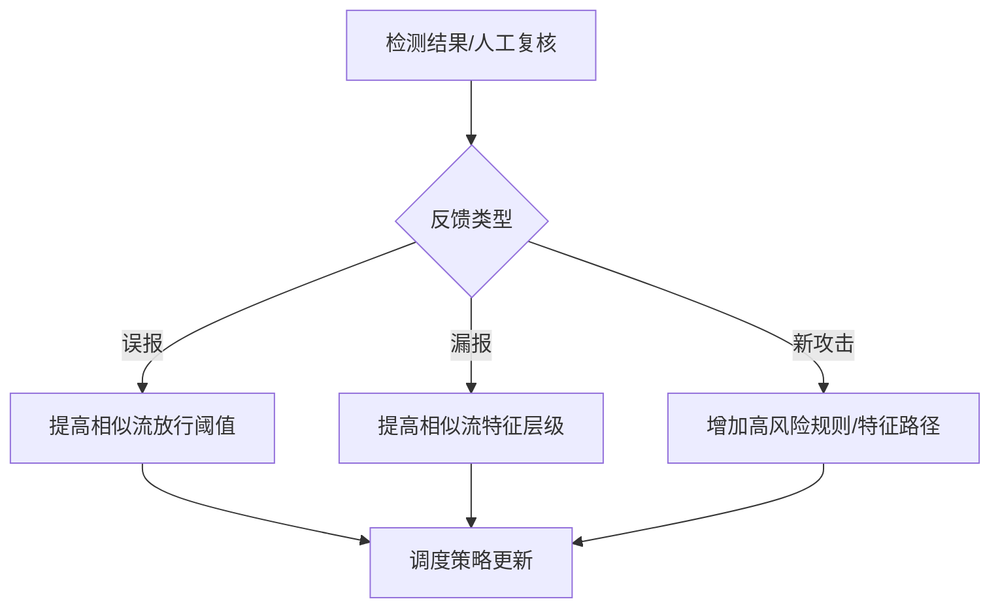

# 附图与流程说明：高速全流量多粒度特征抽取与自适应预算调度方法及装置

## 图1 系统总体架构图

**说明：** 图1展示装置整体结构。风险初筛和资源监测共同驱动预算调度模块，决定每条流进入何种特征抽取路径。

## 图2 特征层级结构图

**说明：** 图2展示特征层级。层级越高，计算成本和信息量通常越高。

## 图3 自适应预算调度流程图

**说明：** 图3展示调度逻辑。在资源拥塞时仍优先保留高风险流，低风险流降级为摘要。

## 图4 队列优先级调度图

**说明：** 图4展示队列调度机制。高风险、高不确定和高资产价值任务优先处理。

## 图5 关系图增量更新流程图

**说明：** 图5展示关系图路径。仅对满足条件的流构建或更新图结构，避免全量图计算。

## 图6 反馈更新流程图

**说明：** 图6展示反馈如何影响后续预算调度。

## 附图编号建议

| 图号 | 名称 | 对应内容 |
|---|---|---|
| 图1 | 系统总体架构图 | 高速接入、风险初筛、预算调度 |
| 图2 | 特征层级结构图 | L0-L4 多粒度特征 |
| 图3 | 自适应预算调度流程图 | 根据风险和资源选择路径 |
| 图4 | 队列优先级调度图 | 高风险优先、低风险降级 |
| 图5 | 关系图增量更新流程图 | L3 图路径 |
| 图6 | 反馈更新流程图 | 调度策略闭环 |

