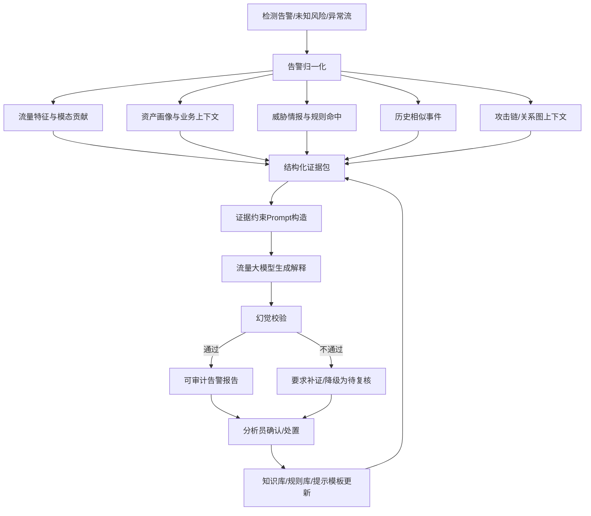

# 流量大模型辅助的告警证据包生成与幻觉校验方法及装置：资料收集

## 1. 拟保护主题

**名称建议：** 流量大模型辅助的告警证据包生成与幻觉校验方法及装置。

**技术领域：** 网络安全运营、流量分析大模型、告警解释、证据检索、幻觉校验、智能 SOC。

**核心构思：** 检测模型负责生成结构化告警和证据，大模型不直接替代检测器；系统将流量特征、检测分数、模态贡献、相似历史事件、威胁情报、资产上下文、攻击链上下文组织为证据包；大模型基于证据包生成告警摘要、攻击假设、复核问题和处置建议；再通过证据引用约束、规则校验、检索校验和多模型一致性校验过滤幻觉。

**装置模块建议：**

1. 告警接入与归一化模块。
2. 流量证据抽取模块。
3. 资产与威胁情报检索模块。
4. 历史相似事件检索模块。
5. 证据包构建模块。
6. 大模型解释生成模块。
7. 幻觉校验模块。
8. 报告输出与人工反馈模块。
9. 规则和知识库更新模块。

## 2. 支撑文献与可借鉴点

| 编号 | 论文 | 可借鉴点 | 不直接照搬的原因 |
|---:|---|---|---|
| [567] | TrafficLLM | 通用流量表示与大模型流量分析 | 需要加入证据约束和 SOC 工程闭环 |
| [594] | LLM for encrypted traffic analysis with MoE LoRA | 大模型高效适配加密流量分析 | 需要避免大模型直接无依据判断 |
| [755] | Multimodal Reasoning with LLM for Encrypted Traffic Interpretation | 多模态推理和解释基准 | 需要形成证据包、校验和反馈装置 |
| [848] | ZTXPlainAI | 零信任可解释加密流量异常检测 | 需要扩展为大模型辅助报告与幻觉控制 |
| [604] | Alert2Vec | 告警子图和告警疲劳抑制 | 可用于相似告警检索和事件聚合 |
| [518]/[804] | 可信开放集与不确定性检测 | 可为证据包提供不确定性和冲突证据 | 本专利重点是解释生成和幻觉校验 |

## 3. 现有技术痛点

### 3.1 传统告警输出的不足

1. IDS/NDR/EDR 通常输出规则名、标签和分数，缺少完整证据链。
2. 分析员需要手工检索流量、资产、日志、情报和历史事件，耗时较高。
3. 重复告警和低质量告警造成告警疲劳，真正高危事件容易被淹没。

### 3.2 直接使用大模型分析安全告警的不足

1. 大模型可能生成没有证据支撑的攻击结论或处置建议。
2. 模型无法天然访问内部资产、私有日志和实时流量上下文。
3. 生成文本难以审计，分析员无法快速判断每个结论来源。

### 3.3 现有可解释检测方法的不足

1. 多停留在特征重要性、热力图或规则命中，不会自动组织成 SOC 可用报告。
2. 缺少将不确定性、模态冲突、相似样本和威胁情报统一为证据包的机制。
3. 人工反馈难以回写到提示模板、知识库和检测规则。

### 3.4 安全运营闭环不足

1. 告警解释、处置建议、规则沉淀和模型更新分散在不同工具中。
2. 复核过程不可追溯，难以评估大模型建议是否可靠。
3. 误报原因、证据缺口和处置结果难以积累为组织知识。

## 4. 系统流程图



## 5. 关键步骤伪代码

### 5.1 证据包构建

```text
Input:
  alert a
  flow record f
  model outputs y
  asset DB A
  threat intel TI
  history index H
Output:
  evidence package P

P.alert_id = a.id
P.basic = NormalizeAlert(a)
P.flow_features = SelectTopFeatures(f, y.feature_importance, top_k)
P.model_evidence = {
    label: y.label,
    score: y.score,
    uncertainty: y.uncertainty,
    open_set_risk: y.unknown_risk,
    modality_conflict: y.conflict
}
P.asset_context = QueryAsset(A, f.src_ip, f.dst_ip)
P.intel_hits = QueryThreatIntel(TI, f.domain, f.ip, f.cert, f.ja3)
P.similar_events = RetrieveSimilar(H, f.embedding, k)
P.graph_context = ExtractLocalAttackGraph(f, window)
P.evidence_ids = AssignEvidenceIds(P)
return P
```

### 5.2 证据约束 Prompt 构造

```text
Input:
  evidence package P
Output:
  prompt prompt

prompt.system = "只能基于给定证据回答；每个结论必须引用证据ID；无证据时输出证据不足。"
prompt.sections = [
    "告警摘要",
    "支持该判断的证据ID",
    "可能攻击阶段",
    "仍需复核的问题",
    "建议处置动作",
    "不确定性和替代解释"
]
prompt.evidence = SerializeEvidence(P, max_tokens)
prompt.constraints = {
    require_citation: true,
    forbid_unseen_ioc: true,
    forbid_unverified_attribution: true,
    output_schema: JSON_SCHEMA
}
return prompt
```

### 5.3 幻觉校验

```text
Input:
  generated report R
  evidence package P
  policy rules C
Output:
  verified report Rv
  verification status status

claims = ExtractClaims(R)
status = "pass"
for claim in claims:
    cited_ids = ExtractEvidenceIds(claim)
    if cited_ids is empty:
        MarkUnsupported(claim)
        status = "fail"
        continue
    support_score = EvidenceSupport(claim, cited_ids, P)
    if support_score < tau_support:
        MarkWeakSupport(claim)
        status = "review"

if ContainsForbiddenAttribution(R) or ContainsUnseenIOC(R, P):
    status = "fail"

if not MatchOutputSchema(R):
    status = "fail"

Rv = RemoveOrDowngradeUnsupportedClaims(R)
return Rv, status
```

### 5.4 多源一致性校验

```text
Input:
  report R
  detector evidence P
  retrieval evidence P_r
  optional second model M2
Output:
  consistency score s

s1 = CheckDetectorConsistency(R, P.model_evidence)
s2 = CheckRetrievalConsistency(R, P_r)
s3 = 1.0
if M2 is available:
    R2 = M2.generate(P)
    s3 = CompareKeyClaims(R, R2)

s = w1*s1 + w2*s2 + w3*s3
if s < tau_consistency:
    FlagForManualReview(R)
return s
```

### 5.5 反馈与知识库更新

```text
Input:
  analyst feedback F
  report R
  evidence package P
Output:
  updated templates, rules, knowledge base

if F.verdict == true_positive:
    AddCaseToHistory(P, R, F)
    PromoteIOCsIfVerified(P.intel_hits)
    GenerateRuleCandidate(P, F)
elif F.verdict == false_positive:
    AddFalsePositivePattern(P)
    AdjustPromptToMentionBenignAlternative(P)
    LowerPriorityForSimilarContext(P.asset_context)
elif F.verdict == insufficient_evidence:
    AddEvidenceGapTemplate(F.missing_fields)

UpdateRetrievalIndex(P, F)
UpdatePromptTemplateStatistics()
return
```

## 6. 技术效果指标

| 指标类型 | 指标 | 建议记录方式 |
|---|---|---|
| 报告质量 | 证据引用覆盖率、无证据结论比例、结构化字段完整率 | 自动校验和人工抽样 |
| 幻觉控制 | Unsupported Claim Rate、Unseen IOC Rate、错误归因率 | 对比无校验 LLM |
| 运营效率 | 单告警平均研判时间、人工复核量、重复告警压缩率 | SOC 实测或回放评估 |
| 检测辅助 | 高危告警确认率、未知告警复核命中率 | 结合检测系统标签 |
| 延迟 | 证据包构建时间、LLM 生成时间、校验时间、端到端报告时间 | P50/P95/P99 |
| 成本 | 每条报告 token 数、LLM 调用次数、缓存命中率 | 对比直接长上下文分析 |
| 可追溯 | 每个结论平均证据数、证据来源数 | 证明审计价值 |
| 反馈收益 | 规则候选采纳率、误报模式沉淀数、模板改进后幻觉下降率 | 按周/月统计 |

## 7. 可替代实施方式

### 7.1 大模型替代

1. 可使用通用 LLM、流量微调 LLM、MoE-LoRA 模型或本地小模型。
2. 可使用双模型结构：小模型生成初稿，大模型复核；或大模型生成，小模型校验。
3. 可使用 RAG 检索增强，也可使用知识图谱约束生成。

### 7.2 证据源替代

1. 流量证据：包序列、流统计、协议字段、图关系、未知风险、不确定性。
2. 资产证据：资产重要性、业务系统、责任人、暴露面、漏洞。
3. 情报告据：IOC、恶意域名、证书、JA3/JA4、样本家族。
4. 历史证据：相似告警、相似攻击链、误报模式、处置记录。

### 7.3 校验方式替代

1. 基于证据 ID 的硬约束校验。
2. 基于自然语言蕴含模型的 claim-evidence 校验。
3. 基于规则的禁止项校验，例如禁止无证据归因到组织或国家。
4. 基于多模型一致性的交叉校验。
5. 基于人工抽检反馈的校验阈值更新。

### 7.4 部署替代

1. SOC 平台内置部署，适合交互式研判。
2. 离线日报生成，适合批量告警总结。
3. 高危告警实时生成，低危告警异步生成。
4. 私有化本地模型部署，或混合云部署但只上传脱敏证据。

## 8. 与论文的差异点

1. 不是复现 [567] TrafficLLM 的流量分析模型，而是把大模型限定在证据解释和 SOC 报告生成环节。
2. 不是复现 [594] 的 MoE-LoRA 适配，而是将模型适配结果纳入证据包，并增加幻觉校验。
3. 不是复现 [755] 的解释基准，而是形成告警接入、证据检索、提示构造、生成、校验、反馈更新的装置流程。
4. 不是复现 [848] 的可解释异常检测框架，而是把解释输出变成可审计报告并要求每条结论绑定证据。
5. 本方案的专利化重点是“证据包 + 证据约束生成 + 幻觉校验 + 反馈闭环”，而不是单纯使用大模型分类流量。

## 9. 交底书下一步补充

1. 定义证据包 JSON schema。
2. 给出报告输出 JSON schema。
3. 给出禁止幻觉规则库样例。
4. 准备无校验 LLM、RAG LLM、本方案三组对比。
5. 统计人工研判时间下降、无证据结论下降和规则候选采纳率。

