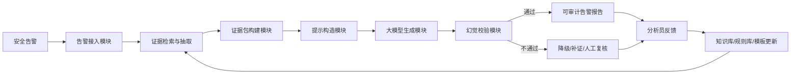
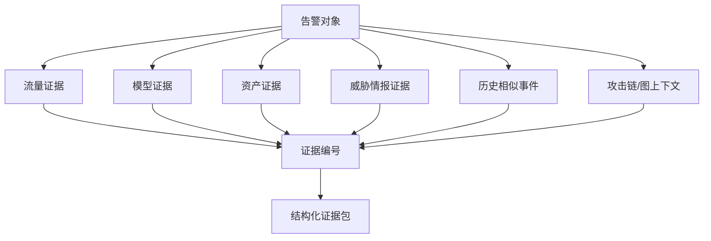
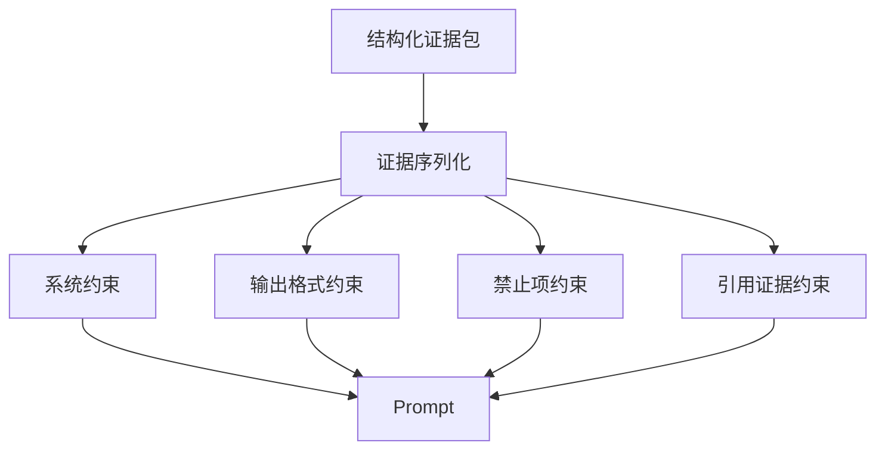
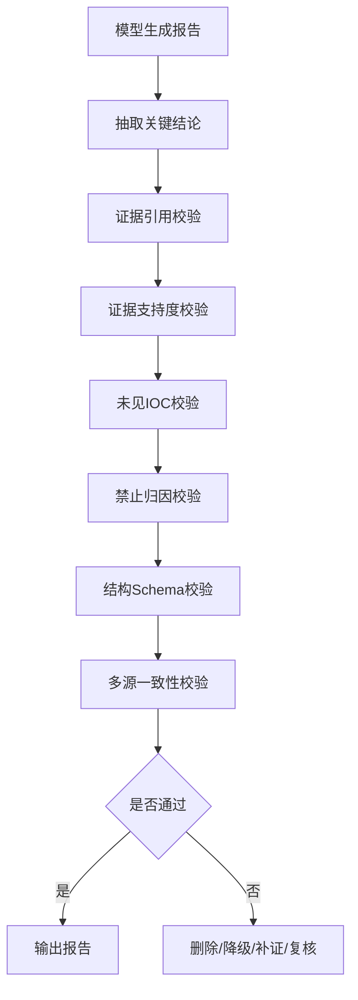
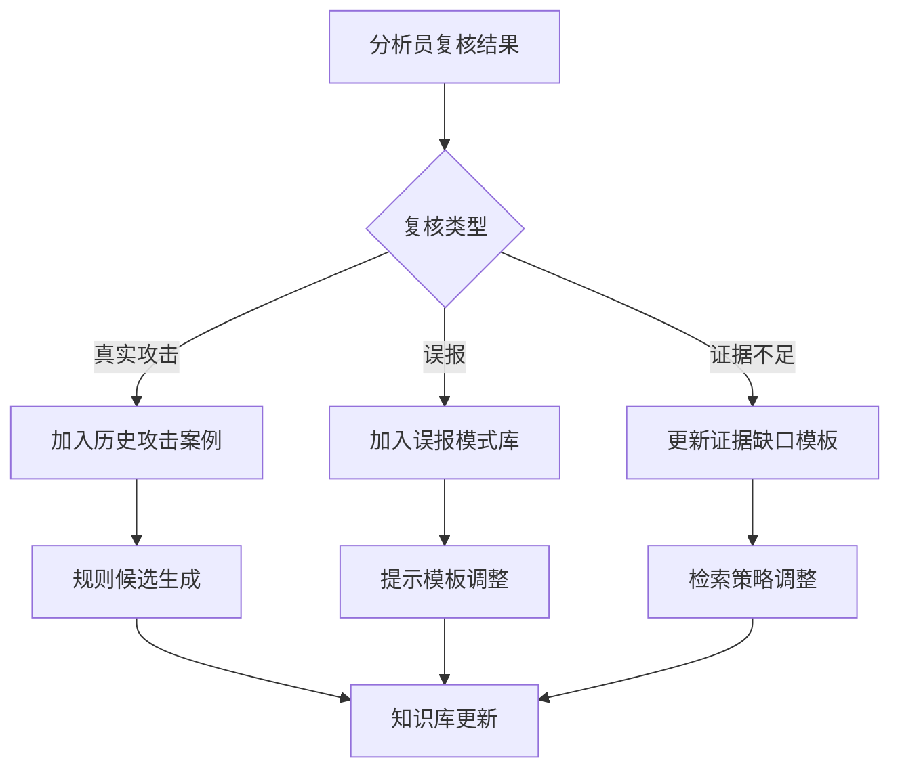
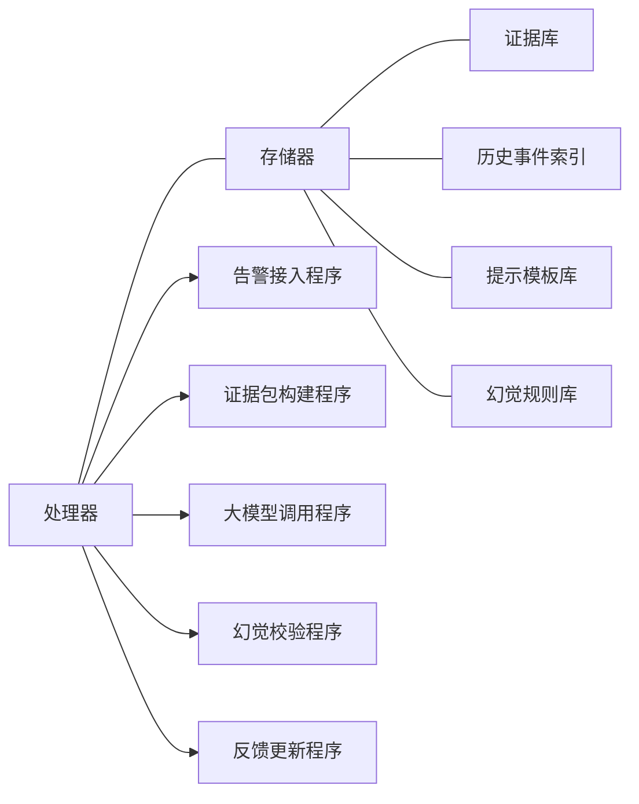

# 附图与流程说明：流量大模型辅助的告警证据包生成与幻觉校验方法及装置

## 图1 系统总体架构图

**说明：** 图1展示系统总流程。大模型生成的报告必须经过幻觉校验后才能输出。

## 图2 证据包构建流程图

**说明：** 图2展示证据包来源。所有证据均分配证据编号，供报告结论引用。

## 图3 证据约束提示构造图

**说明：** 图3展示提示构造。系统约束要求模型只能基于证据回答，无证据时输出证据不足。

## 图4 幻觉校验流程图

**说明：** 图4展示幻觉校验步骤。校验不通过的内容不能作为确定结论输出。

## 图5 反馈更新流程图

**说明：** 图5展示反馈闭环。复核结果用于提升后续证据检索和报告生成质量。

## 图6 装置模块框图

**说明：** 图6用于装置类描述。装置可部署在 SOC 平台或安全数据湖中。

## 附图编号建议

| 图号 | 名称 | 对应内容 |
|---|---|---|
| 图1 | 系统总体架构图 | 告警接入、证据包、大模型、校验、反馈 |
| 图2 | 证据包构建流程图 | 多源证据和证据编号 |
| 图3 | 证据约束提示构造图 | Prompt 约束 |
| 图4 | 幻觉校验流程图 | claim-evidence 校验 |
| 图5 | 反馈更新流程图 | 分析员反馈入库 |
| 图6 | 装置模块框图 | 处理器、存储器、程序模块 |

