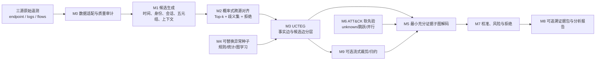
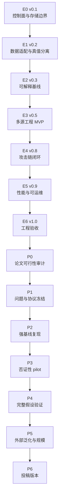

# 端点溯源图—日志—网络流联合 APT 攻击链重构：项目详细规划蓝图

- 蓝图版本：`Blueprint v1.1-deep-read`
- 冻结日期：2026-07-29
- 工作题目：**面向不确定跨源对齐的最小充分 APT 攻击证据链重构**
- 工程代码根：`F:/泉城实验室/二期/论文/异常检测/source/EACR-APT`
- 远端项目根：`/opt/data/private/wangwt/ParkAttackKE/APT-Chain-Reconstruction`
- 文献基础：本地 924 篇 PDF 中收敛出的 71 篇直接核心论文，其中 65 篇来自四大安全顶会或 IEEE TIFS/TDSC；71 篇均已完成全文证据卡、页码定位和有效性边界审查
- 状态：精读后正式执行版；组件、指标和修订差异以 `08_论文精读/` 为证据层

## 0. 精读后冻结决策

1. 第一科学问题冻结为“跨源候选边在歧义条件下能否被校准并正确拒绝”，而不是泛泛的多源融合。
2. 横向移动边必须由认证/登录会话与网络流共同支持；仅 IP、五元组或成功登录不能硬化为跨主机事实。
3. 可信采集与威胁推断分层：丢失、重排、篡改或未知传感器状态必须显式暴露。
4. 首版冻结为可解释候选级联、逻辑回归/GBDT、校准和受约束 beam search；复杂 GNN 只有在否证性 pilot 表明必要时启用。
5. 归约/压缩仅在 H1—H4 通过后启动，并接受 forensic validity、关键连接点保留和下游重跑三重门。
6. 工程 E0—E6 完成后才进入论文 P0—P6；工程吞吐不得替代科学有效性。

精读证据见《71篇全文精读证据卡》《跨论文方法组件综合》《跨论文指标与实验标准》和《精读后蓝图修订说明》。

## 1. 最终目标与验收对象

### 1.1 一句话总目标

在端点溯源事件、主机/认证/应用日志和网络流存在异步、缺失、身份歧义、NAT/代理及部分冲突时，构建一套能够保留跨源关联不确定性、重构最小充分攻击证据子图、在证据不足时主动拒绝，并可回溯至原始事件的 APT 攻击链重构方法与工程系统。

### 1.2 总目标拆解

| 层级 | 目标 | 最终验收对象 |
|---|---|---|
| 数据层 | 三类遥测可统一表达，预测与真值严格隔离 | schema、adapter、quality report、truth manifest、split manifest |
| 对齐层 | 不把时间邻近或身份相似直接硬化为事实边 | Top-k 候选边、概率/置信、歧义集、拒绝原因 |
| 图层 | 事实边、候选边、预测边和真值边物理/逻辑分层 | UCTEG 图契约及完整性检查 |
| 重构层 | 覆盖关键攻击步骤，同时减少无关扩张和无支持桥接 | Top-k 最小充分证据子图 |
| 可信层 | 置信可校准，缺证据时允许 `abstain/incomplete` | reliability、risk–coverage、证据包 |
| 工程层 | 可重复、可恢复、可审计、满足冻结性能目标 | Engineering Acceptance Report |
| 科学层 | H1—H4 在强真值和外部协议上可被支持或反驳 | 预注册实验、置信区间、效应量、失败分析 |
| 论文层 | 所有主张均有论文证据和实验结果双重支撑 | 投稿稿件、主张—证据矩阵、匿名复现包 |

### 1.3 不把什么作为创新

“使用三种数据”“使用 GNN”“使用 ATT&CK”“生成攻击链可视化”本身不构成创新。创新只允许落在三个可证伪命题上：

1. 对齐不确定性贯穿候选生成、图推断、链评分和最终置信，而不是在预处理阶段消失。
2. 输出以最小充分证据为目标，不以扩大异常邻域或生成更大故事图为目标。
3. 将对齐、检测、重构、归因和系统性能拆开评价，并系统刻画缺源和错配造成的失败边界。

## 2. 科学问题、假设和决策规则

| 科学问题 | 可证伪假设 | 主实验 | 支持门 | 反证/转向信号 |
|---|---|---|---|---|
| SQ1：异步和歧义条件下如何恢复真实跨源边？ | H1：概率式对齐优于最佳固定窗/五元组硬连接 | EX2 | alignment edge F1 绝对提升 `>=5pp`，95% bootstrap CI 不跨 0，并降低错误跨主机关联率 | 收益只出现在随机切分、干净数据异常超过 oracle、置乱身份字段后仍不降 |
| SQ2：三源是互补证据还是数据捷径？ | H2：三源相对最佳单源在固定告警预算下提供稳定增益 | EX1、EX4 | PR-AUC 相对提升 `>=10%`，或 Recall@budget 绝对提升 `>=5pp`，且 FP/host-day 增幅 `<=20%` | 单一源移除无影响、辅助源置乱无影响、收益被主机名/IP/攻击文件名解释 |
| SQ3：如何得到最小充分而非最大扩张的链？ | H3：受约束解码提高链边质量，或在基本不损失阶段覆盖时显著降冗余 | EX3、EX9 | chain edge F1 绝对提升 `>=5pp`；或阶段覆盖下降 `<=2pp` 时冗余节点/边减少 `>=20%` | 去掉冗余项、对齐代价或阶段软约束后结果不变 |
| SQ4：缺源、偏移、NAT 和别名下能否可信退化？ | H4：中等扰动下性能保持且校准拒绝减少高置信错误 | EX5、EX10 | 单源缺失 30% 或 `±5s` 偏移后链 F1/PR-AUC 保持完整数据的 `>=80%`，risk–coverage 优于不拒绝基线 | 关键源缺失后仍输出几乎不变的高置信完整链；优先检查泄漏 |
| SQ5：规模化会不会破坏关键证据？ | H5：裁剪/归约达到吞吐目标且保留关键连接点 | EX7 | 吞吐 `>=2×` 实测峰值，p95 满足冻结 SLO，关键证据保留率达到预注册门 | H1—H4 未通过；此时不得用规模指标替代科学有效性 |

上表中的数值是本项目的预注册门槛，不是从某一篇论文复制的已发表性能。文献只用于确定任务、基线类别和指标标准，来源映射见《经典与近期顶会顶刊证据映射.md》，逐篇方法、实验和有效性依据见 `08_论文精读/71篇全文精读证据卡.md`。

## 3. 问题边界与威胁模型

### 3.1 输入

- `E_p`：端点溯源事件，包括 process、file、socket、registry、permission 等。
- `E_l`：认证、系统、安全、PowerShell/Shell、应用、EDR/IDS 告警等日志。
- `E_f`：带开始/结束时间、五元组、方向、包/字节统计和可见协议元数据的网络流。

统一事件最小字段为：

```text
event_id, source_id, source_type, host_id, actor_id, action, object_id,
time_start, time_end, time_uncertainty, sensor_health, raw_pointer
```

### 3.2 输出

系统输出 Top-k 有向证据子图。每条节点和边必须包含来源、时间区间、支持/冲突证据、对齐置信、模型或规则版本以及原始事件定位符。证据不足时允许输出 `abstain`、`incomplete` 或多个竞争假设。

### 3.3 攻击者能力

攻击者可执行低慢攻击、横向移动、凭据滥用、模仿良性行为、删除部分日志、制造良性噪声、利用时钟/身份歧义；不假设攻击者能够同时完全控制所有独立传感器。若审计基础设施本身不可信，应把 CUSTOS、HardLog、OMNILOG 等提出的完整性与可用性问题视为外部信任条件，而不是让检测模型自行“修复”。

### 3.4 当前不解决

- 自动响应和阻断；
- 恶意代码语义还原；
- 纯 PCAP 全流量检测；
- 用 LLM 生成攻击链替代可验证图推断；
- 严格结构因果识别；
- 覆盖全部 ATT&CK 技术。

## 4. 方法总蓝图



### 4.1 M0：数据适配、质量审计和真值隔离

每个适配器输出统一事件、解析覆盖、字段缺失、乱序/重复、时钟残差、传感器健康和 `raw_pointer`。攻击标签、campaign ID、ATT&CK 标签、人工链边不得进入模型输入或候选裁剪。数据读取层、真值读取层和评测层使用独立接口。

### 4.2 M1：分层候选生成

先用可审计规则控制候选空间，再评分，不做全连接：

1. 时间区间重叠和事件类型相关窗口；
2. host/IP/hostname/agent ID 候选解析；
3. user/session/logon ID；
4. PID/PPID/process GUID/image/command line；
5. 正反向五元组、连接开始/结束、bytes/packets；
6. DNS、域名、SNI、证书和代理信息；
7. 一到两跳因果上下文；
8. 传感器可靠性和缺失模式。

候选召回必须先于最终精度优化。候选层报告 Recall@k、候选数和被裁掉的真值边比例。

### 4.3 M2：概率式跨源对齐

对候选边 `e_ij` 构造可解释特征 `φ_ij`，输出：

```text
p_ij = Calibrate(g(φ_ij))
```

其中 `g` 的首版优先采用可解释的加权规则、逻辑回归或树模型；只有它们在 H1 pilot 中失败且存在充分样本时才引入学习式图编码。输出必须保留 `components`、Top-k、margin、歧义集和拒绝原因。

### 4.4 M3：不确定跨源时序证据图 UCTEG

```text
G = (V, E_prov ∪ E_same-source ∪ E_align ∪ E_lateral
        ∪ E_ttp-soft ∪ E_pred ∪ E_truth)
```

- `E_prov`：可信端点信息流/操作性因果边；
- `E_same-source`：同源时序、身份或会话边；
- `E_align`：带概率的跨源候选边；
- `E_lateral`：由网络和认证共同支持的横向移动候选边；
- `E_ttp-soft`：ATT&CK 兼容性软边；
- `E_pred`：模型输出边；
- `E_truth`：仅评测可见的真值边。

硬约束：`E_pred` 不得回写成原始事实，`E_truth` 不得进入训练特征，派生视图不得冒充独立模态。

### 4.5 M4：可替换异常种子

种子可来自规则、人工 POI、统计异常、日志语义模型、provenance PIDS 或横向移动检测器。KAIROS、FLASH、MAGIC、THREATRACE、Hopper、EULER、DEEPCASE 等仅提供强基线或种子，不与主创新绑定。主实验必须比较统一种子和各自原始种子两种设置，避免把检测器差异误认为重构器差异。

### 4.6 M5：最小充分证据子图

对候选子图 `S` 使用如下概念目标：

```text
S* = argmax [
      α·SeedCoverage(S)
    + β·CrossSourceSupport(S)
    + γ·StageCompatibility(S)
    + η·KeyStepCoverage(S)
    - λ·AlignmentUncertainty(S)
    - μ·UnsupportedBridge(S)
    - ν·TemporalViolation(S)
    - ρ·Redundancy(S)
]
```

约束包括时间单调、端点信息流可达、会话连续、跨主机连接一致、证据预算和 `unknown` 松弛。实现顺序为 beam search/启发式、prize-collecting Steiner/arborescence、小图整数规划；只有可解释版本不能满足 H3 时再评估学习式解码。

### 4.7 M6：ATT&CK 软先验

ATT&CK 仅提供兼容度和可读标签。必须允许跳阶段、并行分支、循环/重试和 `unknown`，并保留“无 ATT&CK 约束”消融。TREC 和 Zoomer 用作语义解释基线，HOLMES 用作阶段规则基线。

### 4.8 M7：校准、风险和拒绝

首版在 temperature scaling、isotonic regression 中择一，并报告 Brier、NLL、ECE、reliability diagram 和 risk–coverage。若链分数不具备概率含义，应明确称为“置信评分”，不得伪称概率。拒绝阈值只在验证集冻结。

### 4.9 M8：证据包

每个预测链输出：

- 原始事件定位符；
- 节点/边类型及来源；
- 候选特征、对齐分数和校准版本；
- 支持与冲突证据；
- 攻击阶段分布和未知项；
- 被拒绝候选及原因；
- 图规模、运行 ID、配置哈希和代码提交；
- 可由分析员复核的最小事件清单。

### 4.10 M9：可选效率层

仅在 H1—H4 通过后启动。候选包括 dependence-preserving compaction、SEAL、DEPCOMM、NodeMerge、High-Fidelity Reduction、TeRed 和 StreamSpot 式流式 sketch。任何压缩结果必须同时报告缩减率、攻击节点/边保留率、跨源连接点保留率和查询/重构等价性。

## 5. 数据角色与结论边界

| 层级 | 数据 | 角色 | 可以支撑 | 不能支撑 |
|---|---|---|---|---|
| D0 | 小型合成 fixture | 单元测试、schema、故障注入 | 代码正确性 | 方法有效性 |
| D1 | 自建 strong-truth 18–24 runs | 主协议 | 对齐边、链节点/边、步骤、阶段精确评价 | 大规模开放世界泛化 |
| D2 | CICAPT-IIoT2024 | 公开同场景多源审计 | provenance/flow/攻击步骤联合验证，须先审计真值粒度 | 未审计前的完整跨主机链结论 |
| D3 | DARPA TC CADETS/THEIA/TRACE | provenance 基准 | 端点因果、检测、归因、跨平台 | 缺独立精确网络关联时的完整三源结论 |
| D4 | OpTC | 多主机 Windows 和规模 | 规模、候选桥接、外部调查 | 自动等同精确链真值 |
| D5 | LANL Cyber1 11GB | 长时间弱标签 | 单/双/三源消融、红队锚点、Recall@budget、FP/host-day | 事件级完整攻击链 |
| D6 | LANL unified 181GB | 大规模协议 | events/s、延迟、资源、候选规模 | 更强的链真值 |
| D7 | SAGA/NODLINK simulated/其他生成数据 | 压力和失败边界 | 缺源、偏移、噪声控制实验 | 主要有效性 |
| D8 | DIDS-MFL/纯 flow 数据 | flow 种子外部验证 | 网络分支泛化 | 三源攻击链 |

数据资产状态来自 2026-07-16 至 2026-07-29 的项目记录；任何正式实验前必须重新运行远端只读 preflight，并冻结 manifest，不把历史记录当作实时完成证明。

## 6. 六层指标契约

| 层 | 主指标 | 辅助/诊断指标 | 禁止替代 |
|---|---|---|---|
| 数据质量 | 解析率、真值覆盖率、时钟残差、歧义率 | 缺失、重复、乱序、攻击显眼度、背景多样性、基率 | 只报告文件数 |
| 检测 | PR-AUC、MCC、Recall@budget、FP/host-day | node/event P/R/F1、TTFD | accuracy 或 ROC-AUC 单独作主结论 |
| 对齐 | edge P/R/F1、Top-k Recall、MRR | wrong-host merge、unmatched recall、Brier/NLL/ECE | 只报告候选命中率 |
| 链重构 | node/edge/step P/R/F1、Chain Recall@k | 阶段覆盖、顺序编辑距离、GED、断链率、错误桥接率 | 只报告节点检测 F1 |
| 归因/负担 | QoA、关键连接点保留率、检查节点/边/事件数 | reduction ratio、不可解释边比例 | 只报告压缩比 |
| 系统/复现 | events/s、p50/p95/p99、RAM/VRAM/磁盘、恢复时间 | 冷启动、确定性、运行成功率 | 单次平均延迟 |

完整定义、统计单位、公式和门禁见《分层指标与统计协议.md》。

## 7. 工程路线与论文路线



规则如下：

1. E0—E6 全部通过后，才允许论文版本从 P0 开始晋级。
2. 文献证据卡、真值工具和基线容器可与工程并行准备，但不计为论文版本完成。
3. 论文阶段提出的新工程需求回写为工程 `v1.1+`，通过回归门后再进入论文实验。
4. 工程通过只说明系统可靠运行，不自动支持“优于基线”“可泛化”或“具有创新性”。
5. 论文门通过必须同时有预注册协议、效应量、置信区间、失败分析和可复现运行记录。

详细门禁见《工程版_论文版里程碑门禁.md》。

## 8. 36 周时间蓝图

| 周 | 主阶段 | 核心交付 | 退出门 |
|---:|---|---|---|
| 1–2 | E0 | 路径、manifest、配置、存储策略、运行登记 | 本地无数据/权重/凭据；所有远端角色可审计 |
| 3–6 | E1 | schema、3+ adapters、truth 隔离、质量报告 | 数据与真值接口分离；错误可定位 |
| 7–9 | E2 | oracle/硬匹配/BFS/最短路/Steiner 下界 | 同输入确定性输出；评测器人工可核验 |
| 10–13 | E3 | 候选、概率对齐、UCTEG、Top-k/拒绝 | 3 个场景端到端跑通 |
| 14–17 | E4 | 最小证据子图、证据包、CLI/流水线 | manifest 到报告一条命令；失败可恢复 |
| 18–20 | E5 | 流式处理、监控、故障注入 | 达到冻结 SLO，无未解释资源增长 |
| 21 | E6 | Engineering Acceptance Report | 新环境复现、全量回归通过 |
| 22 | P0 | 数据/真值/显眼度/基率审计 | 至少一套强真值主协议成立 |
| 23 | P1 | SQ/H、split、指标、阈值规则预注册 | 无 host/time/campaign 泄漏 |
| 24–26 | P2 | 强基线公平复现 | 同数据、真值、预算、硬件 |
| 27–28 | P3 | H1/H3 两周 pilot | Go 门成立；否则转向 |
| 29–32 | P4 | H1—H4、消融、鲁棒性 | CI、效应量和 Holm 校正支持主张 |
| 33–34 | P5 | 未见攻击族、外部数据、规模、QoA | 外部结果可解释且结论不过界 |
| 35–36 | P6 | 论文、图表、匿名复现、引用核验 | 主张—证据闭环 |

## 9. 当前起点审计

截至本蓝图冻结：

- `schema.py` 已有统一事件和独立真值对象；
- `alignment.py` 已有可解释的跨源成对评分及 ambiguity 拒绝；
- `reconstruct.py` 已有确定性 beam-search 下界和链评分；
- 本地存储策略、远端路径和数据采集工具已存在；
- 2026-07-29 本地运行 schema/alignment/reconstruct/local-policy 共 9 项单元测试，结果为 9/9 通过。

这些证据只说明 **E0 基础较完整、E1/E2 有最小代码骨架**，不表示 E1、E2 或更高版本已经验收。适配器、强真值、完整评测器、UCTEG、校准器、端到端流水线和性能报告仍未完成。

## 10. 停止、收缩和转向

| 触发条件 | 禁止做法 | 转向 |
|---|---|---|
| 无法得到可审计三源强真值 | 后验拼接不相干数据集并称三源真值 | 降级双源或 ChainBreak |
| H1 不成立 | 继续叠加 GNN/LLM 掩盖错配 | 对齐失败边界基准 |
| 三源不优于最佳单源 | 只报告平均 F1 并隐藏单源 | 删除多源互补主张 |
| 对齐改善但链级无改善 | 把 edge F1 包装成完整链贡献 | 只保留对齐/候选排序论文 |
| 最小子图不降冗余或损害关键步骤 | 扩大图再做可视化 | 转连接点保真归约 |
| 仅规模不过门 | 推翻已成立方法结论 | 工程 `v1.1` 启动效率层 |
| 只在已见攻击脚本有效 | 声称开放世界泛化 | 转未见攻击族/捷径研究 |

## 11. 最终交付清单

1. 工程代码、测试、配置模板和同步策略；
2. 强真值 schema、采集协议、标注协议和质量报告；
3. 数据/环境/运行/split manifests；
4. 可解释基线、强学习基线和公平复现报告；
5. UCTEG、概率对齐、最小充分解码、校准拒绝和证据包；
6. EX0—EX10 实验结果、失败案例和统计报告；
7. Engineering Acceptance Report；
8. 主张—证据矩阵、论文图表、匿名代码与配置复现包；
9. 投稿版本及完整局限性说明。

## 12. 相关正式文档

- 《工程版_论文版里程碑门禁.md》
- 《UCTEG与最小充分证据子图技术规格.md》
- 《分层指标与统计协议.md》
- 《数据角色_远端路径_运行登记规范.md》
- 《工程WBS与验收测试.md》
- 《经典与近期顶会顶刊证据映射.md》
- 《论文版本路线与主张边界.md》
- 《蓝图决策日志_20260729.md》
