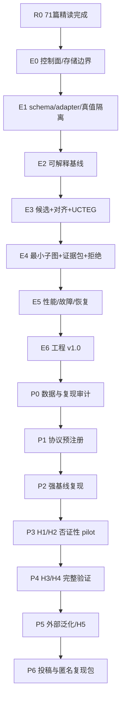

# 精读后蓝图修订说明

- 修订依据：71 篇全文证据卡
- 原蓝图：`Blueprint v1.0`
- 修订版本：`Blueprint v1.1-deep-read`
- 修订性质：研究问题收紧、组件降级/升级、实验门增强，不改变“先工程、后论文”的总体路线

## 1. 修订结论

71 篇全文精读支持继续开展“端点 provenance + 日志 + 网络流联合 APT 攻击链重构”，但不支持把“三模态融合”或“使用 GNN”本身作为论文创新。最终论文应收敛为：

> 面向跨源对齐歧义和传感器不完备的可拒绝最小充分 APT 证据链重构。

## 2. 相对 v1.0 的实质变化

| 项目 | v1.0 | v1.1-deep-read | 证据 |
|---|---|---|---|
| 第一科学问题 | 多源是否提高检测/重构 | 跨源边能否在歧义下被正确校准和拒绝 | L33、L64–L65、L68 |
| 跨主机边 | 网络+认证候选 | 强制 session/auth 与 flow 共同支持 | L64、L68 |
| 可信边界 | 威胁模型附属项 | 独立 M0 采集健康与完整性门 | L40、L48–L49、L51、L53、L57、L61 |
| 主模型 | 可解释模型优先 | 明确冻结为级联候选+LR/GBDT+校准首版 | L09、L60、L62 |
| 图重构 | 最小充分子图 | 增加错误桥接、被裁边原因和多个竞争子图 | L10、L31、L54、L66、L69 |
| ATT&CK | 软先验 | 仅解释层，主表必须有 no-prior 与 unknown | L05、L17、L70 |
| 压缩 | H1–H4 后启用 | 增加 forensic validity 硬门 | L31、L42、L54、L67 |
| 可复现 | 运行登记 | 上升为论文晋级门：端到端脚本/模型/标签/资源/失败 | L60、L62 |
| 数据 | strong-truth 主协议 | 增加会话级跨主机边、传感器健康和竞争候选真值 | L64、L68 |
| 合成数据 | 压力实验 | 明确禁止承担主要有效性 | L15、L60、L71 |

## 3. 重新冻结的总目标

在三类遥测异步、缺失、冲突且身份存在歧义时：

1. 构造事实边与候选边分层的 UCTEG；
2. 校准端点—日志、端点—flow、日志—flow 及跨主机会话候选边；
3. 从统一种子重构 Top-k 最小充分证据子图；
4. 在证据不足时输出竞争假设、`incomplete` 或 `abstain`；
5. 保证每条预测边可回溯到原始事件和传感器健康状态；
6. 先达到工程 v1.0，再按预注册 H1–H5 进入论文 P0–P6。

## 4. 重新冻结的科学问题

| SQ | 问题 | 核心假设 | 主要否证 |
|---|---|---|---|
| SQ1 | 如何恢复真实跨源边？ | H1：概率对齐优于固定窗/硬连接 | 只在随机切分有效；置乱身份后不降 |
| SQ2 | 三源是否提供互补证据？ | H2：三源在固定预算优于最佳单源 | 去掉/置乱辅助源无影响 |
| SQ3 | 如何得到最小充分链？ | H3：受约束解码提升边质量或显著降冗余 | 去掉关键约束无变化 |
| SQ4 | 缺源和歧义下能否可信退化？ | H4：校准拒绝减少高置信错链 | 缺源后仍输出不变的高置信完整链 |
| SQ5 | 规模优化是否保持取证有效？ | H5：达到 SLO 且保持关键连接点/查询等价 | 仅速度提高但链保真下降 |

## 5. 论文贡献的最大允许范围

若 H1–H4 全部通过，可主张：

1. 一个显式建模跨源候选不确定性的证据图与对齐方法；
2. 一个受约束、可拒绝的最小充分攻击证据子图解码器；
3. 一个覆盖数据质量、对齐、链、归因、鲁棒和系统性能的统一实验协议。

不能主张：

- 解决所有 APT 检测或全部 ATT&CK 技术；
- 识别严格结构因果；
- 对任意企业/平台普遍泛化；
- 在无强真值数据上证明完整三源攻击链；
- 合成数据上的高分代表真实部署效果；
- 采集器被完全控制时仍能恢复事实。

## 6. 路线调整

新增停止规则：

1. H1 不成立：论文不得以跨源对齐为主贡献，转为工程系统或数据/评测论文；
2. H2 不成立：删除“多源互补”主张，保留最小必要源组合；
3. H3 不成立：采用最简单强基线，不包装复杂解码；
4. H4 不成立：不得使用“可信”措辞，只报告已知条件下性能；
5. H1–H4 未通过：不得用 H5 的速度和压缩比替代科学贡献。

## 7. 精读后新增交付物

- `08_论文精读/71篇全文精读证据卡.md`
- `08_论文精读/跨论文方法组件综合.md`
- `08_论文精读/跨论文指标与实验标准.md`
- `08_论文精读/精读后蓝图修订说明.md`
- `_索引/全文提取审计.json`
- `_索引/阅读定位包.jsonl`

本说明与上述文件共同构成 `Blueprint v1.1-deep-read` 的证据层。

