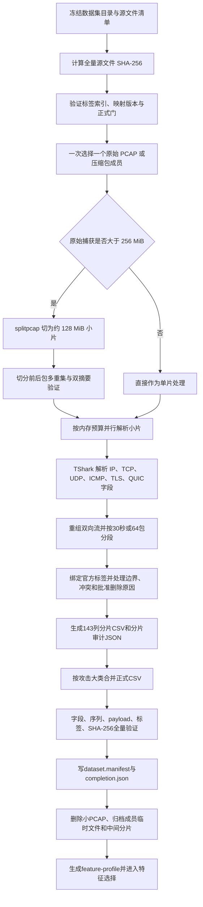

# 恶意流量统一特征处理流程与特征清单

版本：2026-08-07  
适用代码：`source/CAEOS-EMTD`  
目标数据版本：`caeos_unified_multimodal_v5`  
基础CSV模式：`caeos_unified_multimodal_csv_schema_v4`  
处理原则：`extract_once_select_later_without_unknown_test_feedback`

## 一、当前结论

当前特征采集设计已经能够覆盖CAEOS-EMTD所需的三类观测：payload语义、包行为和包交互图构图原语。基础CSV升级并冻结为143列，每行表示一个双向流段；采集层保留最多64包、前4096字节传输层payload、前2048字节脱敏L4字节、完整流段统计、方向统计、Active/Idle、TCP标志、TLS/QUIC结构提示和标签追溯字段。后续实验只选择特征视图，不再回读PCAP或减少采集内容。

86列v3资格运行已经终止并废弃；143列v4正式特征处理以本文件第十四节记录的运行状态为准：

- 2026-08-07已从Edge-IIoTset重新启动，远端PID为 `588275`，日志为 `_control/feature_extraction/formal_v5_schema_v4_20260807.log`。
- 首两个PCAP均为v4全新计算而非复用，共生成21,020条流；抽查分片严格为143列，schema字段为 `caeos_unified_multimodal_csv_schema_v4`。
- `_control/label_index_manifest.json` 的8个恶意数据集均已通过标签入口门；特征队列按单数据集串行、单原始PCAP串行、仅分片内并行执行。
- `completion.json` 尚未生成，因此当前状态是“正式运行中”，不能表述为特征处理完成。

## 二、处理对象和输出单位

### 2.1 输入对象

正式恶意流量特征处理对象为：CICIoT2023、CICIoT2022、Edge-IIoTset、CICIDS2017、CIC-BoT-IoT、CIC-ToN-IoT、CICDDoS2019和DoHBrw2020。

ISCX Tor/NonTor、ISCX VPN/NonVPN、PARROT2025和CrossPlatform主要承担良性域偏移与误报安全验证，不进入恶意攻击训练主集合。CICAPT-IIoT2024已按用户要求排除。

### 2.2 一行CSV的定义

- 行单位：`bidirectional_flow_segment`，即一个规范化双向五元组的流段。
- 双向键：源和目的端排序后的IP、端口和传输层协议；原始IP/MAC不写入CSV。
- 空闲超时：30秒。
- 每个流段最多64包；超过64包继续生成下一 `flow_segment_index`，不是丢弃后续包。
- IPv4非首分片没有L4头时端口置0，IP负载仍作为payload保留。
- payload不解密；TLS和QUIC字段是协议解析提示，不是攻击标签。

## 三、正式处理流程

### 3.1 启动前门禁

1. 源清单必须覆盖全部PCAP和压缩包成员，并记录路径、大小和SHA-256。
2. 标签索引manifest中的数据集必须为 `status=ready`；索引文件记录数、schema、数据集ID和SHA-256全部通过。
3. 标签规则必须冻结：冲突策略、时间不重叠策略、允许删除原因和标签映射版本均进入处理策略哈希。
4. 固定TShark身份、splitpcap提交、schema哈希和预处理代码哈希；任一身份变化不得复用旧分片。
5. 输出目录不得存在身份不一致的正式文件；`.partial` 只能作为当前原子写入临时文件。

### 3.2 原始捕获调度

1. 每次只处理一个数据集中的一个原始PCAP或一个压缩包PCAP成员。
2. 压缩包成员流式解出到临时文件，不永久保留重复副本。
3. 大于256 MiB的捕获使用固定提交 `fca18e270fe49d0cf1ba37ffd2bab901a797401a` 的 `jmhIcoding/splitpcap` 切分。
4. 目标小片约128 MiB，单原始捕获最多256片。
5. 切分后验证包时间、捕获长度、包原始字节多重集一致；验证失败不得提取特征。
6. 并行只作用于同一原始捕获的小片，不允许多个原始PCAP或多个数据集同时展开。

### 3.3 并行和内存控制

当前v5调度参数为：32核可见预算、CPU worker上限24、内存预算190 GiB、预留46 GiB、单worker估计6 GiB、安全系数2。实际并行数为：

`workers = min(CPU上限, 小片数, floor((190-46)/(6×2)))`

按当前参数，内存门最多允许12个小片worker。该计算只决定并行度，不减少包数、payload长度或特征字段。解析器还设置最大活跃流数以限制匿名内存；达到上限时完成最早活跃流段并记录 `active_flow_limit`，不能静默丢弃。

### 3.4 TShark解析

正式默认解析器为TShark，最低版本3.6.2。关闭IP重组、IPv6重组和TCP流重组，以保证切片之间处理语义稳定。原始解析字段覆盖：

- 帧：时间戳、帧长度、协议栈提示；
- IPv4/IPv6：地址、总长度、DSCP/ECN、flags、分片偏移/ID、TTL/Hop Limit、下一协议；
- TCP：端口、头长、原始seq/ack、flags、window和payload；
- UDP：端口、长度和payload；
- ICMP/ICMPv6：type和code；
- TLS：record类型、版本、长度和handshake类型；
- QUIC：version。

### 3.5 流重组与标签绑定

1. 按规范化双向五元组聚合，保留每包方向。
2. 遇到30秒空闲、64包上限、活跃流限制、捕获结束或官方标签边界时完成当前流段。
3. 流级数据集使用方向无关五元组与时间区间查询官方只读SQLite索引。
4. 一个流跨越不同官方标签边界时，只有启用 `official_boundary_split` 且逐包边界可解析时才能拆段。
5. 多标签冲突、路径标签与外部标签冲突不得进入正式CSV。
6. 未匹配流只有命中预先批准的删除原因时才删除，并同时记录流、包和字节数量及比例。
7. 最终类别CSV仅接受 `binary_label` 为0或1、攻击大类非Pending且 `label_status` 以 `aligned_unique_` 开头的行。

### 3.6 分片、合并和清理

1. 每个小片先写无表头的 `.partial`，完成 `flush + fsync` 后原子改名。
2. 每个分片生成JSON，记录源SHA-256、schema、解析器、策略哈希、行数、删除原因和峰值活跃流。
3. 一个原始捕获全部小片完成后生成capture marker。
4. 数据集全部捕获完成后，按攻击大类生成 `Benign.csv`、`DDoS.csv`、`DoS.csv` 等正式CSV。
5. 每个类别CSV记录行数、大小、SHA-256和验证结果；数据集生成 `dataset.manifest.json`。
6. 全部指定数据集完成后生成 `completion.json`；只有 `all_complete=true` 才能进入下一阶段。
7. 原始捕获完成后删除splitpcap小片、临时解压文件和中间part；不删除原始PCAP、官方标签和正式CSV。

## 四、冻结的143列基础特征清单

以下为CSV中实际写入的143列。分组是互斥的，计数合计为143。

### 4.1 溯源与标签证据：11列，只用于审计

`schema_version`、`dataset_id`、`dataset_role`、`sample_id`、`capture_id`、`source_container_sha256`、`source_member`、`label_status`、`label_source`、`label_mapping_version`、`dataset_native_label`。

这些字段用于追溯样本、验证数据身份和审计标签来源，全部禁止作为模型输入。

### 4.2 目标标签：6列

`traffic_class`、`attack_category`、`attack_subcategory`、`fine_label`、`family_label`、`binary_label`。

- 正常流：`traffic_class=Benign`、`binary_label=0`、`attack_category=Benign`。
- 恶意流：`traffic_class=Malicious`、`binary_label=1`，同时必须存在攻击大类和细粒度标签。
- 冻结攻击大类：Benign、DDoS、DoS、Reconnaissance、Brute_Force、Spoofing_MITM、Botnet_Malware、DNS_Tunneling、Web_Attack、Other_Attack。
- Pending仅允许存在于内部临时part，不允许进入正式类别CSV。

### 4.3 流身份、时间和分组字段：8列，默认禁止入模

`flow_segment_index`、`flow_key_hash`、`flow_start_ns`、`flow_end_ns`、`endpoint_a_hash`、`endpoint_b_hash`、`port_a`、`port_b`。

用途是capture/fingerprint分组切分、重复检测、时间漂移分析和泄漏诊断。主实验禁用端点、端口和绝对时间，避免模型记忆设备、服务端口或采集场景。

### 4.4 包序列质量字段：1列

`packet_count_stored`：该流段实际存储的包数，范围1至64，用于校验序列长度和构造padding mask。

### 4.5 安全包行为标量：85列

`duration_us`、`ip_version`、`transport_protocol`、`packet_count_total`、`forward_packet_count`、`reverse_packet_count`、`packet_bytes_total`、`forward_packet_bytes`、`reverse_packet_bytes`、`payload_bytes_total`、`forward_payload_bytes`、`reverse_payload_bytes`、`fragmented_packet_count`、`noninitial_fragment_count`、`packet_length_min`、`packet_length_max`、`packet_length_mean`、`packet_length_std`、`packet_iat_us_min`、`packet_iat_us_max`、`packet_iat_us_mean`、`packet_iat_us_std`、`packet_payload_length_min`、`packet_payload_length_max`、`packet_payload_length_mean`、`packet_payload_length_std`、`packets_per_second`、`bytes_per_second`。

原28列继续保留。v4新增57列：正反向传输头字节2列、正反向比率2列、方向切换4列、包长高阶统计4列、正反向包长8列、IAT高阶统计5列、正反向IAT 10列、payload长度高阶统计4列、Active统计5列、Idle统计5列及TCP标志计数8列。Active/Idle使用固定5秒包间隔阈值；方差和偏度均按总体统计量计算。速率、时长和计数应在训练集拟合变换，建议采用 `log1p` 后再做稳健缩放；不得使用全数据集统计量拟合归一化器。

### 4.6 Payload与脱敏L4字节：6列

`payload_bytes_stored`、`payload_b64`、`sanitized_l4_bytes_total`、`sanitized_l4_bytes_stored`、`sanitized_l4_b64`、`payload_histogram`。

- `payload_b64`：按流方向到达顺序拼接的前4096字节传输层payload，Base64编码。
- `payload_histogram`：完整流段全部payload的256维字节频数，不受4096字节前缀截断影响。
- `sanitized_l4_b64`：前2048字节规范化L4头和payload；校验和清零，不含IP/MAC。
- `payload_bytes_stored` 和 `sanitized_l4_bytes_stored` 用于校验解码长度和模态可用性。

Payload语义模态同时可以引用行为标量中的 `payload_bytes_total`、`forward_payload_bytes` 和 `reverse_payload_bytes`。字节模型的实验长度从256、512、1024、2048、4096中选择，但基础库始终保存4096字节上限。

### 4.7 前64包序列：17列

`packet_length_seq`、`ip_length_seq`、`packet_iat_us_seq`、`direction_seq`、`packet_protocol_seq`、`tcp_flags_seq`、`ip_dscp_ecn_seq`、`ip_flags_seq`、`ip_fragment_offset_seq`、`ip_fragment_id_seq`、`transport_header_length_seq`、`tcp_sequence_seq`、`tcp_acknowledgement_seq`、`packet_payload_length_seq`、`sanitized_l4_packet_length_seq`、`packet_ttl_seq`、`tcp_window_seq`。

所有序列使用分号分隔十进制数，长度必须严格等于 `packet_count_stored`。实验层可选择前8、16、32或64包，基础库不重新提取。

### 4.8 加密协议结构：9列

`application_protocol_hint`、`tls_record_type_seq`、`tls_record_version_seq`、`tls_record_length_seq`、`tls_handshake_type_seq`、`tls_client_hello_present`、`tls_server_hello_present`、`quic_long_header_packet_count`、`quic_version_seq`。

其中 `application_protocol_hint` 可能由协议解析或53、80、443等端口推断，默认禁止入模，只用于诊断。其余8列是可缺失的TLS/QUIC结构子视图；缺失不能直接解释为良性或未知。

## 五、三模态实验视图

| 模态 | 直接来源 | 实验输入 | 当前边界 |
|---|---|---|---|
| Payload语义 | payload前缀、字节直方图、双向payload计数、脱敏L4前缀 | 字节CNN/Transformer、直方图MLP、原始字节基线 | 不解密；没有payload必须显式mask |
| 包行为 | 85项安全标量、17项包序列、TLS/QUIC结构 | MLP、1D-CNN、RNN或Transformer | 端口、绝对时间、应用提示默认禁用 |
| 包交互图 | 包长度、IAT、方向、payload长度、flags、TTL等序列 | 包节点和时间/方向边上的GNN | 图在实验层构建，不是CSV中的独立原始模态 |

图边规则冻结为：时间相邻、同方向burst成员关系、请求-响应方向切换。主实验禁止把端点哈希、端口、capture ID和文件名放入节点或边特征。

## 六、由基础字段派生但尚未写入CSV的特征

v5特征视图配置仍声明7项可复算特征：

`initiator_relative_direction_seq`、`signed_packet_length_seq`、`directional_burst_count`、`directional_burst_packet_count_summary`、`directional_burst_byte_summary`、`payload_presence_fraction`、`modality_missingness_mask`。原派生项 `direction_switch_rate` 和TCP八类标志计数已在v4直接写入CSV。

这些特征可由143列基础库确定性复算，因此无需重新读取PCAP；但当前统一预处理器不会把它们写入CSV，代码库中也尚未形成统一的v5 feature-view materializer。后续必须新增版本化转换器，输出派生缓存及其输入schema哈希、转换代码哈希和输出SHA-256。

## 七、默认禁止作为模型输入的19列

`dataset_id`、`dataset_role`、`sample_id`、`capture_id`、`source_container_sha256`、`source_member`、`label_status`、`label_source`、`label_mapping_version`、`dataset_native_label`、`flow_key_hash`、`flow_start_ns`、`flow_end_ns`、`endpoint_a_hash`、`endpoint_b_hash`、`port_a`、`port_b`、`application_protocol_hint`、`flow_segment_index`。

这些字段只用于分组、追溯、重复审计、错误定位和泄漏基线。即使port-only或endpoint-only获得高分，也只能作为数据泄漏证据，不能进入论文主结果。

## 八、各恶意数据集的主特征视图

| 数据集 | 主视图 | 辅助视图 | 必须防范的捷径 |
|---|---|---|---|
| CICIoT2023 | 三模态全部 | 分片、flags、方向burst | 设备、PCAP路径和重复攻击脚本 |
| CICIoT2022 | 包行为 + payload，三模态外部确认 | capture级分层 | Active良性capture跨集合重叠 |
| Edge-IIoTset | 三模态全部 | 协议结构带missing mask | 单攻击单capture、协议即标签 |
| CICIDS2017 | 包行为为主 | payload、图；Web/Brute Force专项 | 日期、IP、端口和场景 |
| CIC-BoT-IoT | 包行为 + payload | burst/请求响应图 | 高频重复流、端点和攻击事件 |
| CIC-ToN-IoT | payload + 包行为 | 图为辅 | 时间窗错配、遥测与网络流混用 |
| CICDDoS2019 | 包行为为主 | 图为辅，payload仅消融 | 目标端口、IP、速率和采集日 |
| DoHBrw2020 | TLS结构 + 长度/IAT/方向 | payload分布、交互图 | 工具指纹、TLS实现和截断源 |

## 九、特征选择与实验切分

1. 基础采集固定64包、4096 payload字节、2048脱敏L4字节，不按数据集删列。
2. 特征选择、缩放器、缺失填充、PCA、编码器和阈值只能拟合训练集与known-only validation。
3. unknown test的特征分布、标签和最优阈值在冻结前不可见。
4. 按capture或fingerprint分组切分，避免同源流段跨训练、验证和测试。
5. 对payload前缀、包序列和流时间指纹做重复哈希审计。
6. 必做单模态、两两组合和三模态消融。
7. 必做payload字节顺序打乱、包时间置换、图边置换、TLS结构开关和模态dropout。
8. 分开报告已知识别、未知拒识、跨数据集未知拒识和良性域偏移误报。

## 十、最终质量门

### 10.1 源与切分门

- 所有源文件SHA-256与冻结manifest一致。
- 大PCAP切分前后包数量、时间、捕获长度和原始字节多重集完全一致。
- 原始PCAP、官方标签文件均未修改。

### 10.2 标签门

- 正式CSV无Pending、unmapped、unresolved和冲突行。
- `traffic_class`、`binary_label`、攻击大类和细粒度标签一致。
- 删除流、包、字节的数量、比例、原因和规则完整记录。

### 10.3 CSV与特征门

- 表头与冻结143列schema完全一致，无多列或少列。
- 所有17项序列长度等于 `packet_count_stored`，且范围为1至64。
- Base64可解码，解码长度与stored字段一致；payload不超过4096字节，脱敏L4不超过2048字节。
- payload直方图固定256维，频数和等于 `payload_bytes_total`。
- 标量无NaN和Inf；类型和取值范围符合schema。
- 每个类别CSV和manifest均有行数、大小和SHA-256。

### 10.4 Feature-profile门

每个数据集必须报告：

- 行数、攻击大类和细粒度分布；
- payload、双向流、TLS、QUIC和完整64包的可用率；
- 64包、4096 payload和2048脱敏L4的截断率；
- port-only、endpoint-only、time-only、source-only泄漏诊断；
- payload、包序列和流指纹重复率；
- 各特征缺失率、常量率、异常值率和跨数据集可比性。

## 十一、启动前必须整改的P0问题

1. 将7套已完成标签数据集的最终索引和summary持久化到v5 `_control`，重建 `label_index_manifest.json`，使相应条目达到 `status=ready`。
2. CICIoT2022和CICIoT2023目前是捕获/成员级标签权威，需要实现只读capture-member resolver，并输出统一的 `aligned_unique_capture_member` 状态；不能直接使用现有 `capture_path` 状态，因为类别CSV合并器会拒绝。
3. DoHBrw2020必须把源质量例外策略哈希纳入特征处理身份，并确保截断边界仍活跃流不会进入正式CSV。
4. 实现v5 feature-view materializer，确定性生成9项派生特征和图张量。
5. 冻结图节点维度。v5配置声明6项节点源，而现有strict-v4训练缓存按每包5维节点读取；必须升级适配器或发布新的缓存schema，禁止静默截断TTL或其他节点字段。
6. 对攻击大类映射执行逐数据集单元测试和人工抽查，避免通过字符串启发式把Backdoor、Web或DNS隧道映射到错误大类。
7. 完成一个小型真实PCAP端到端资格运行，验证split、TShark、标签、143列CSV、类别合并、feature-view转换和清理，再启动全量队列。

## 十二、建议执行顺序

1. 完成索引持久化和统一manifest重建。
2. 先用Edge-IIoTset最小真实PCAP做端到端资格验证。
3. 依次处理 CICIoT2023、CICIoT2022、Edge-IIoTset、CICIDS2017、CIC-BoT-IoT、CIC-ToN-IoT、CICDDoS2019。
4. DoHBrw2020单独按源质量例外协议处理并单列报告。
5. 每完成一个数据集立即生成类别CSV、manifest、feature-profile和校验报告，再清除切片。
6. 只有全量 `completion.json`、各数据集 `dataset.manifest.json` 和feature-profile均通过，才允许进入正式多种子SOTA实验。

## 十三、机器可读契约

- 数据集与资源：`source/CAEOS-EMTD/configs/unified_multimodal_v5_split_class.datasets.json`
- 143列schema：`source/CAEOS-EMTD/configs/unified_multimodal_v4.schema.json`
- 三模态视图：`source/CAEOS-EMTD/configs/unified_multimodal_v5.feature_views.json`
- 分片调度器：`source/CAEOS-EMTD/prepare_caeos_splitpcap_class_csv.py`
- 流重组与特征提取：`source/CAEOS-EMTD/prepare_caeos_unified_multimodal_csv.py`
- 标签解析：`source/CAEOS-EMTD/caeos_label_alignment.py`

以上JSON和代码是执行真值；本文档是研究与工程口径说明。任何字段增删、长度变化、图节点维度变化或标签接口变化都必须发布新的schema版本，不能覆盖v4/v5既有契约。

## 十四、本次核验记录

1. 机器检查确认v4 schema包含143列、19个默认禁用字段和7个尚未物化的派生字段。
2. GPU服务器运行 `test_feature_view_contract.py`、`test_caeos_unified_multimodal_csv.py`、`test_splitpcap_class_orchestrator.py` 和 `test_splitpcap_integration_contract.py`，结果为 `26 passed in 0.76s`。
3. Edge-IIoTset的 `Vulnerability scanner attack.pcap` 在265,827个有效包后存在损坏尾记录；`pcapfix 1.1.7` 深度修复副本通过完整TShark扫描，原文件不修改，修复身份由 `_control/pcap_repair_manifest.json` 冻结。
4. 旧v3 Edge中间结果9.5 GB已作为可重建产物清理；v4恢复逻辑会强制校验schema、处理策略和修复清单哈希，禁止复用旧列结果。
5. 本地默认Anaconda的pytest在导入阶段因异常 `pwd/pkg_resources/zipfile` 循环依赖未运行到项目测试；本次有效测试证据来自GPU服务器代码。
